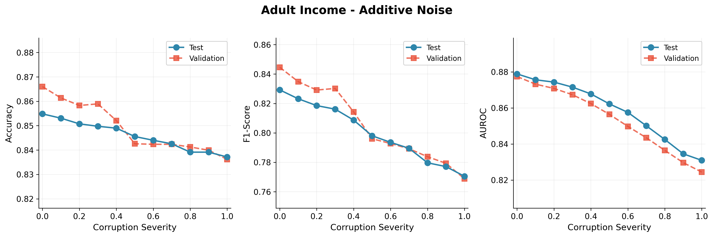
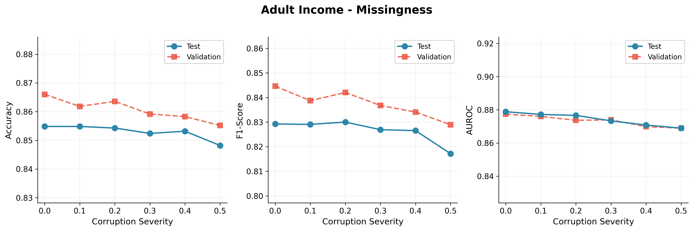
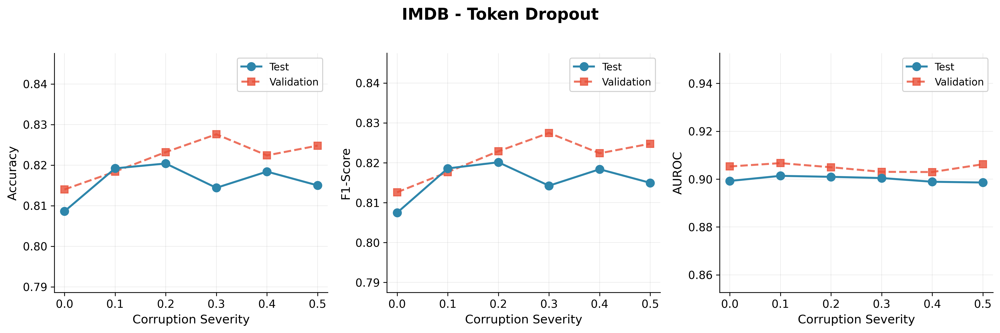

# Week 4: Pilot Analysis/Summary

**Date:** February 4, 2026  
**Objective:** Validate corruption pipelines, verify degradation patterns, and establish baseline performance.

---

## Context for Readers

### Glossary: Corruption Types

**Additive noise.** Random noise is added to numeric features. The noise is zero-mean Gaussian; its standard deviation is set as a fraction of each feature’s standard deviation, with that fraction equal to the severity (0 = no noise, 1 = noise with std equal to the feature’s std). This mimics measurement error, sensor drift, or rounding. Example: for "age" with std 10 years, severity 0.3 means we add noise with std 3 years.

**Missingness.** A fraction of feature values are randomly replaced with "missing" (NaN). Severity is the fraction of eligible entries we mask (0 = none, 0.5 = half, 1 = all). The pipeline then uses a fixed imputation strategy (e.g. mean) so that we measure robustness to missing data, not to different imputation choices. This mimics incomplete surveys, failed sensors, or dropped fields.

**Token dropout.** For text represented as TF-IDF, we randomly set a fraction of the non-zero TF-IDF entries to zero. Severity is the fraction of non-zero entries we drop (0 = none, 0.5 = half). This mimics incomplete text, missing words, or loss of informative terms without changing the vocabulary.

**Class imbalance.** We subsample only the minority class in the training set so that the ratio of minority to majority size equals the severity (1 = balanced, 0.1 = minority is 10% of majority size). Validation and test sets are unchanged. This isolates the effect of training-set imbalance on robustness. (Used in the Adult setting; not yet included in the Week 4 pilot tables below.)

### Why These Datasets (and Where Is Amazon?)

Week 4 pilots use **Adult**, **IMDB**, and **Airbnb** (in-domain corruption experiments). **Amazon** is not a fourth benchmark: it is the **out-of-domain test set** for the IMDB→Amazon domain-shift study. Models are trained on IMDB only and evaluated on IMDB test (in-domain) and Amazon (out-of-domain). Domain-shift results will be reported later; this document shows only the three in-domain datasets.

---

## 1. Baseline Performance (Clean Data)

| Dataset | Model | Accuracy | F1-Score | AUROC |
|---------|-------|----------|----------|-------|
| Adult Income | Random Forest | 0.855 | 0.829 | 0.879 |
| IMDB | Linear SVM | 0.858 | 0.858 | 0.937 |
| Airbnb | Random Forest (Regression) | RMSE: 0.409 | MAE: 0.296 | — |

**Notes:**
- Adult Income is a tabular binary classification task (income >50K vs ≤50K)
- IMDB is a text sentiment classification task (positive vs negative reviews)
- Airbnb is a regression task predicting log-transformed price

---

## 2. Understanding Corruption Severity

### 2.1 What Does Severity 0.0 to 1.0 Mean?

The severity parameter controls **how much** corruption is applied. It's normalized to a 0–1 scale, but what this means differs by corruption type:

| Corruption Type | Severity = 0.0 | Severity = 0.5 | Severity = 1.0 |
|-----------------|----------------|----------------|----------------|
| **Additive Noise** | No noise added | Noise with std = 0.5 × feature std | Noise with std = 1.0 × feature std |
| **Missingness** | No missing values | 50% of values randomly set to NaN | 100% missing (unusable) |
| **Token Dropout** | No tokens dropped | 50% of TF-IDF entries zeroed | 100% zeroed (no signal) |
| **Class Imbalance** | Original class ratio | Minority class reduced to 50% of original | Minority class reduced to ~0 |

**Concrete examples:**

- **Additive noise at 0.3:** For a feature like "age" with standard deviation of 10 years, we add Gaussian noise with std = 3 years. A person who is actually 35 might appear as 32 or 38 in the corrupted data.
- **Missingness at 0.2:** 20% of all feature values are randomly replaced with NaN. If you have 14 features and 1000 samples, approximately 2,800 individual values become missing.
- **Token dropout at 0.4:** 40% of the non-zero TF-IDF weights are set to zero. If a review originally had 50 important word features, now only ~30 remain.

### 2.2 Why Do Some Experiments Stop at 0.5?

We chose different severity ranges for different corruption types based on **practical interpretability**:

| Experiment | Max Severity | Rationale |
|------------|--------------|-----------|
| Additive Noise | 1.0 | Noise equal to feature std is already extreme but interpretable |
| Missingness | 0.5 | Beyond 50% missing, mean imputation becomes unreliable; real-world missingness rarely exceeds 30-40% |
| Token Dropout | 0.5 | Dropping >50% of tokens approaches random guessing; also serves as pilot to verify pipeline |

**Key insight:** We focus on severity ranges where models can still learn; e.g. 100% missingness would leave no signal.

### 2.3 Why Validation and Test Curves Differ (and Why Validation Is Often Higher)

In the plots, the **validation** (orange dashed) and **test** (blue solid) curves don’t overlap exactly. That is expected and healthy.

**Why they differ:**
1. **Different samples:** The validation set (10% of data) and test set (20% of data) contain different examples, so metric estimates can differ.
2. **Statistical variance:** The validation set is smaller, so its metrics can vary more from the true generalization performance.
3. **No data leakage:** The model never sees test data during training or hyperparameter selection, so test is a strictly held-out estimate.

**Why validation is often a bit higher than test:** The same model is evaluated on two different splits. Sometimes the validation split happens to be slightly “easier” (e.g. more representative of the training distribution), so validation accuracy/F1 can sit slightly above test. A small, consistent gap (as we see here, typically within 1–2%) indicates good generalization rather than overfitting. A large gap (validation much higher than test) would suggest overfitting to the validation set; we do not see that here.

---

## 3. Degradation Experiments

### 3.1 Adult Income — Additive Noise

**Configuration:** Gaussian noise scaled by feature standard deviation  
**Severity Range:** 0.0 → 1.0 (11 points)  
**Model:** Random Forest



| Severity | Test Accuracy | Test F1 | Test AUROC |
|----------|---------------|---------|------------|
| 0.00 | 0.8548 | 0.8292 | 0.8789 |
| 0.10 | 0.8531 | 0.8232 | 0.8756 |
| 0.20 | 0.8507 | 0.8186 | 0.8743 |
| 0.30 | 0.8498 | 0.8162 | 0.8715 |
| 0.40 | 0.8490 | 0.8087 | 0.8678 |
| 0.50 | 0.8456 | 0.7980 | 0.8622 |
| 0.60 | 0.8440 | 0.7936 | 0.8575 |
| 0.70 | 0.8426 | 0.7895 | 0.8501 |
| 0.80 | 0.8391 | 0.7797 | 0.8425 |
| 0.90 | 0.8391 | 0.7771 | 0.8345 |
| 1.00 | 0.8371 | 0.7705 | 0.8309 |

**Summary Statistics:**
- Accuracy drop: 1.8 percentage points (2.1%)
- F1 drop: 5.9 percentage points (7.1%)
- AUROC drop: 4.8 percentage points (5.5%)
- Degradation slope: -0.018 per unit severity

**Interpretation:**  
Random Forest shows monotonic, gradual degradation under additive noise. F1-score is most sensitive because noise disproportionately affects minority class predictions. The smooth degradation curve indicates reliable corruption implementation.

---

### 3.2 Adult Income — Missingness

**Configuration:** Random masking to NaN, followed by mean imputation  
**Severity Range:** 0.0 → 0.5 (6 points)  
**Model:** Random Forest



| Severity | Test Accuracy | Test F1 | Test AUROC |
|----------|---------------|---------|------------|
| 0.00 | 0.8548 | 0.8292 | 0.8789 |
| 0.10 | 0.8548 | 0.8291 | 0.8772 |
| 0.20 | 0.8543 | 0.8300 | 0.8767 |
| 0.30 | 0.8524 | 0.8269 | 0.8733 |
| 0.40 | 0.8532 | 0.8265 | 0.8708 |
| 0.50 | 0.8482 | 0.8171 | 0.8689 |

**Summary Statistics:**
- Accuracy drop: 0.7 percentage points (0.8%)
- F1 drop: 1.2 percentage points (1.5%)
- AUROC drop: 1.0 percentage points (1.1%)
- Degradation slope: -0.011 per unit severity

**Interpretation:**  
Random Forest combined with mean imputation is highly robust to missing values. Even at 50% missingness, performance degradation is minimal. Tree-based models effectively leverage the remaining structure after imputation.

---

### 3.3 IMDB — Token Dropout

**Configuration:** Random zeroing of TF-IDF feature entries  
**Severity Range:** 0.0 → 0.5 (6 points)  
**Model:** Linear SVM



| Severity | Test Accuracy | Test F1 | Test AUROC |
|----------|---------------|---------|------------|
| 0.00 | 0.8086 | 0.8075 | 0.8992 |
| 0.10 | 0.8192 | 0.8186 | 0.9014 |
| 0.20 | 0.8204 | 0.8201 | 0.9010 |
| 0.30 | 0.8144 | 0.8143 | 0.9005 |
| 0.40 | 0.8184 | 0.8184 | 0.8989 |
| 0.50 | 0.8150 | 0.8150 | 0.8986 |

**Summary Statistics:**
- Accuracy drop: ~0% (no meaningful degradation)
- AUROC drop: ~0.1 percentage points
- Degradation slope: +0.007 (essentially flat)

**Interpretation:**  
Linear SVM on TF-IDF features shows remarkable robustness to token dropout. Performance remains stable even with 50% of tokens randomly dropped. This suggests:
1. Sentiment classification relies on key discriminative words that survive random dropout
2. TF-IDF sparsity means further sparsification has limited additional impact
3. Slight performance improvements at low severity may indicate a regularization effect

---

## 4. Key Findings

### 4.1 Corruption Sensitivity Varies by Metric
- **F1-score** is consistently more sensitive than accuracy for the Adult dataset
- This reflects the class imbalance in Adult Income (76% majority class)
- For balanced datasets like IMDB, accuracy and F1 track closely

### 4.2 Model-Corruption Interactions
| Corruption Type | Model Robustness |
|-----------------|------------------|
| Additive Noise | Moderate (gradual degradation) |
| Missingness | High (minimal impact with imputation) |
| Token Dropout | Very High (no degradation observed) |

### 4.3 How to Read These Results
- Each run uses **one** corruption type at one severity (no mixing). Corruptions are applied **only to the training set**; val/test stay clean.
- We report **F1** and **AUROC** in addition to accuracy because Adult is class-imbalanced; F1 and AUROC are more informative for ranking and minority-class performance.

---

## 5. Full Experimental Design (How the Actual Experiment Will Run)

### 5.0 What we actually run (the combinations)

Each line is a **dataset × corruption** family. For each family we run every **model** at every **severity** (and optionally every **seed**). One run = one (dataset, corruption, model, severity, [seed]).

| We run | Meaning |
|--------|--------|
| **Adult × additive noise** | For each model (RF, XGB, SVM), run one experiment per severity (e.g. 0.0, 0.1, …, 1.0). Gives one degradation curve per model. |
| **Adult × missingness** | Same: each model × each severity (e.g. 0.0–0.5). One curve per model. |
| **Adult × class imbalance** | Same: each model × each severity. One curve per model. |
| **IMDB × token dropout** | Each model × each severity; evaluate on IMDB test. One curve per model. |
| **IMDB → Amazon (domain shift)** | Train each model on IMDB only; evaluate on IMDB test and on Amazon. No severity sweep—it’s one train/test setup per model. |
| **Airbnb × noise** | Selected regression models × each severity. One curve per model. |
| **Airbnb × missingness** | Same. One curve per model. |

We do **not** mix corruptions in one run. Each run is exactly one dataset, one corruption type, one model, one severity. Domain shift is separate: IMDB train → IMDB test and IMDB train → Amazon.

**Hyperparameter tuning.** We tune each model **only on clean data** (severity = 0), using the held-out validation set (or cross-validation). The chosen hyperparameters are **frozen** and reused for every severity level. We do not re-tune at each severity. That way degradation curves reflect the model's inherent robustness rather than adaptation to corruption; tuning at each severity would mask sensitivity.

### 5.1 Full run details

Adult and IMDB: one degradation curve per (model, corruption) pair; each condition repeated over multiple seeds for uncertainty. IMDB in-domain = token dropout × severity × model; domain shift = train on IMDB, evaluate on IMDB test and Amazon. Airbnb: noise and missingness × severity × selected regression models (exploratory). All runs use fixed preprocessing, splits, and metrics; configs and seeds are saved for reproducibility.

---

## 6. Validation Checklist (Pilot)

- [x] Baselines run successfully for all 3 datasets
- [x] Severity grids produce monotonic degradation (where expected)
- [x] Metrics computed correctly (accuracy, F1, AUROC for classification; RMSE, MAE for regression)
- [x] Corruption applied only to training data (validation/test remain clean)
- [x] Results saved with full configuration for reproducibility
- [x] Plots generated at publication quality (300 DPI)

---

## 7. Next Steps

1. **Expand corruption types:** Run class imbalance experiments on Adult
2. **Cross-model comparison:** Test multiple models (SVM, XGBoost) on same corruption
3. **Airbnb regression:** Run noise/missingness grids for regression baseline
4. **Multi-seed runs:** Add uncertainty quantification with 3-5 seeds per configuration

---

## 8. Output Files

```
outputs/
├── runs/
│   ├── adult_baseline/
│   ├── imdb_baseline/
│   └── airbnb_baseline/
├── severity_grids/
│   ├── adult_noise/          (11 runs)
│   ├── adult_missingness/    (6 runs)
│   └── imdb_token_dropout/   (6 runs)
└── summary/
    ├── baseline_results.csv
    ├── adult_noise_degradation.png
    ├── adult_missingness_degradation.png
    └── imdb_token_dropout_degradation.png
```

---

## Use of AI

This document and the associated pilot experiments were prepared with the use of AI-assisted tools (e.g., Cursor/LLM-based coding and writing assistance). AI was used to: structure and draft explanatory sections (e.g., glossary, dataset rationale, interpretation notes), generate and refine code for running experiments and producing plots, and format tables and markdown. All experimental design choices, dataset selection, corruption definitions, and result interpretations remain the author’s. Figures and numerical results come from runs executed in the thesis codebase; AI was not used to generate or alter raw metrics. This disclosure is provided in accordance with course and institutional expectations for transparency about the use of AI in academic work.
