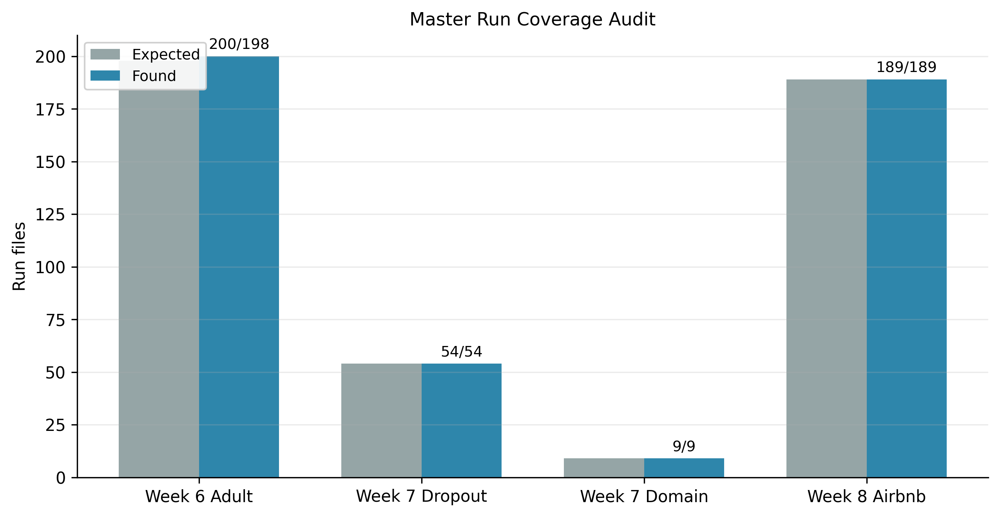
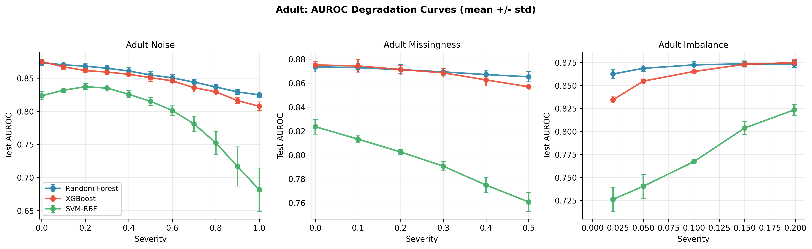
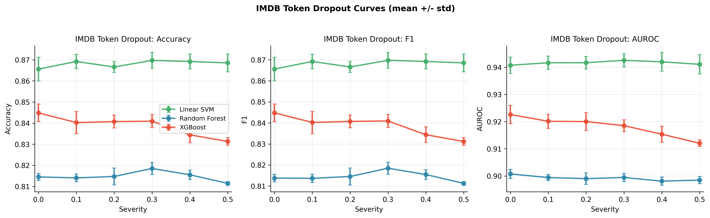
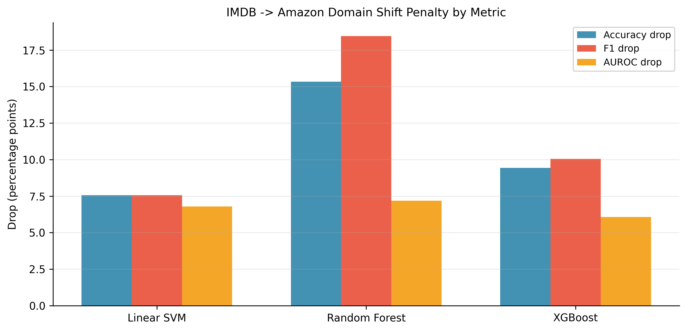
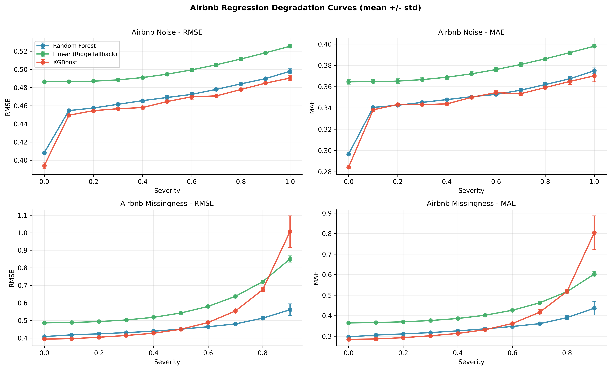
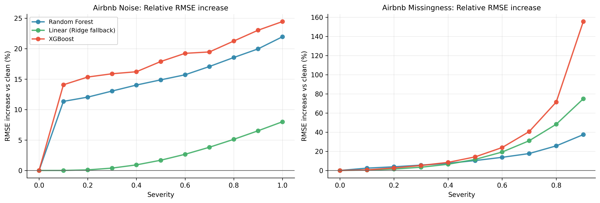

# Master Results: All Experiments (Weeks 6-8)

Date: 2026-03-09  
Scope: Canonical thesis experiment set across Adult (tabular classification), IMDB/Amazon (text classification), and Airbnb (regression).

---

## 1) Canonical Artifacts Used

- Week 6 (Adult, corrected rerun): `../week6_rerun/`
- Week 7 (text, corrected rerun): `../week7_rerun_20260305/`
- Week 8 (Airbnb, completed matrix): `../week8_20260305/`

Primary week-level writeups:
- Week 6: `../week6/WEEK6_RESULTS.md`
- Week 7: `../week7_rerun_20260305/WEEK7_RERUN_RESULTS.md`
- Week 8: `../week8_20260305/WEEK8_RESULTS.md`

Master machine-readable summary:
- `master_summary_stats.json`

---

## 2) Coverage Audit (Run Completeness)

| Block | Completed | Expected | Status |
|---|---:|---:|---|
| Week 6 Adult (all families) | 200 | 198 | Complete (+2 duplicate SVM-noise run files) |
| Week 7 IMDB token dropout | 54 | 54 | Complete |
| Week 7 IMDB -> Amazon domain shift | 9 | 9 | Complete |
| Week 8 Airbnb (noise + missingness) | 189 | 189 | Complete |
| **Total raw run files** | **452** | **450** | **Complete** |

Notes:
- The extra 2 files are duplicate run directories in `week6_rerun/adult_noise_svm`; canonical 3-seed stability summaries are unaffected.
- Week 8 missingness uses `0.0 -> 0.9` by design (`1.0` is degenerate for this dataset).

---

## 3) Thesis Figure Suite (Master Pack)

The master pack now includes multiple figures (not just one summary bar chart):

### 3.1 Coverage and QA Figure

Use this in appendix/methods QA to demonstrate execution completeness.

### 3.2 Adult AUROC Degradation Curves

Use this as the main Week 6 cross-corruption comparison figure.

### 3.3 IMDB Token Dropout Curves

Shows synthetic text corruption trends for accuracy/F1/AUROC.

### 3.4 IMDB -> Amazon Domain Shift Penalty

Shows out-of-domain drop by metric and model.

### 3.5 Airbnb Absolute Degradation Curves

Main Week 8 regression figure (RMSE and MAE, noise and missingness).

### 3.6 Airbnb Relative RMSE Increase

Normalizes by each model's clean baseline, making robustness comparisons fairer.

### 3.7 High-Level Cross-Experiment Summary

Good for intro-to-results overview slide/page.

---

## 4) Unified Robustness Tables (Core Results)

### 4.1 Adult (Week 6): Test AUROC change from clean to worst severity

Values are delta in percentage points (pp), `worst - clean`.

| Corruption | RF | XGB | SVM-RBF |
|---|---:|---:|---:|
| Additive noise (`0.0 -> 1.0`) | -4.87 | -6.75 | -14.21 |
| Missingness (`0.0 -> 0.5`) | -0.83 | -1.82 | -6.28 |
| Imbalance (`0.02 -> 0.199`) | +1.09 | +4.04 | +9.73 |

### 4.2 IMDB Token Dropout (Week 7): Test AUROC change `0.5 - clean`

| Model | Delta AUROC (pp) |
|---|---:|
| Linear SVM | +0.03 |
| Random Forest | -0.23 |
| XGBoost | -1.06 |

### 4.3 IMDB -> Amazon Domain Shift (Week 7): AUROC drop `IMDB test - Amazon`

| Model | AUROC drop (pp) |
|---|---:|
| Linear SVM | 6.79 |
| Random Forest | 7.18 |
| XGBoost | 6.07 |

### 4.4 Airbnb (Week 8): Error inflation from clean to worst severity

#### RMSE increase (`worst - clean`)

| Corruption | Random Forest | Linear (Ridge fallback) | XGBoost |
|---|---:|---:|---:|
| Additive noise (`0.0 -> 1.0`) | +0.0896 | +0.0389 | +0.0963 |
| Missingness (`0.0 -> 0.9`) | +0.1528 | +0.3639 | +0.6126 |

#### MAE increase (`worst - clean`)

| Corruption | Random Forest | Linear (Ridge fallback) | XGBoost |
|---|---:|---:|---:|
| Additive noise (`0.0 -> 1.0`) | +0.0784 | +0.0335 | +0.0858 |
| Missingness (`0.0 -> 0.9`) | +0.1399 | +0.2380 | +0.5199 |

---

## 5) Exportable Thesis Tables (CSV Pack)

These are ready to import into LaTeX/Word tables:

- `tables/table01_run_coverage.csv`
- `tables/table02_adult_clean_vs_worst.csv`
- `tables/table03_imdb_token_dropout_clean_vs_worst.csv`
- `tables/table04_imdb_domain_shift_drops.csv`
- `tables/table05_airbnb_clean_vs_worst.csv`

---

## 6) Airbnb Plot Sanity Check

Yes, the Airbnb plots make sense.

What is consistent with expected behavior:
- Additive noise causes smooth, moderate degradation for all three models.
- Missingness causes strongly non-linear degradation, especially at high severity.
- XGBoost is best at clean/low severity but becomes most brittle at severe missingness (sharp tail-up and wider error bars).
- The linear baseline has worse absolute error at clean conditions but can appear less steep under additive noise.

Why the extra relative plot matters:
- Absolute RMSE/MAE curves can hide robustness differences when clean baselines differ.
- `fig06_airbnb_relative_rmse_increase.png` solves that by showing percent increase vs each model's own clean point.

---

## 7) Thesis-Ready Figure/Table Shortlist

Recommended for main Results chapter (not appendix):

Figures:
1. `figures/fig02_adult_auroc_curves.png`
2. `figures/fig03_imdb_token_dropout_metrics.png`
3. `figures/fig04_imdb_domain_shift_drops.png`
4. `figures/fig05_airbnb_absolute_curves.png`
5. `figures/fig06_airbnb_relative_rmse_increase.png`
6. `master_combined_comparison.png` (overview at start of Results)

Tables:
1. Adult clean-vs-worst summary (Section 4.1)
2. IMDB token-dropout deltas (Section 4.2)
3. IMDB->Amazon drops (Section 4.3)
4. Airbnb RMSE/MAE inflation (Section 4.4)
5. Full numeric appendix from CSV pack in `tables/`

---

## 8) Final Status

Experimentation status:
- Week 6, Week 7, Week 8 run matrices are complete for the agreed canonical scope.
- Master figure and table pack is complete.
- Remaining work is writing/polish (Discussion, Conclusion, final formatting, presentation deck).

