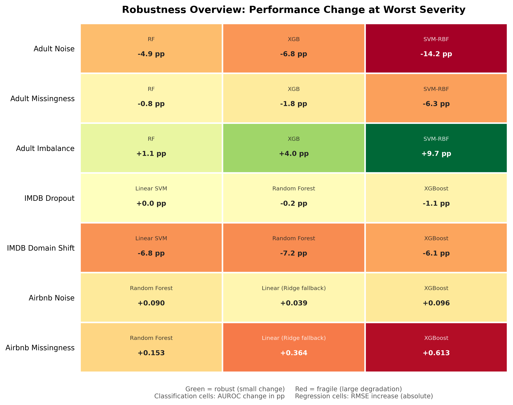
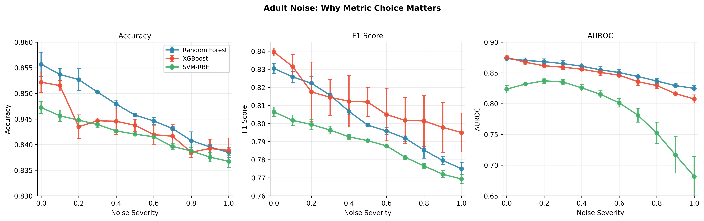
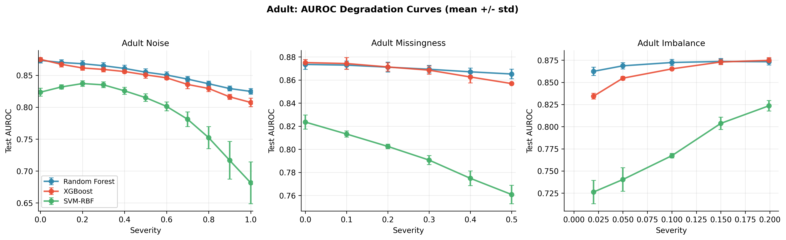
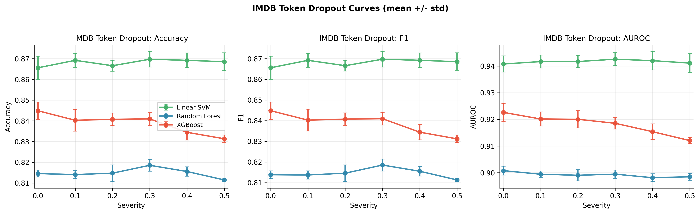
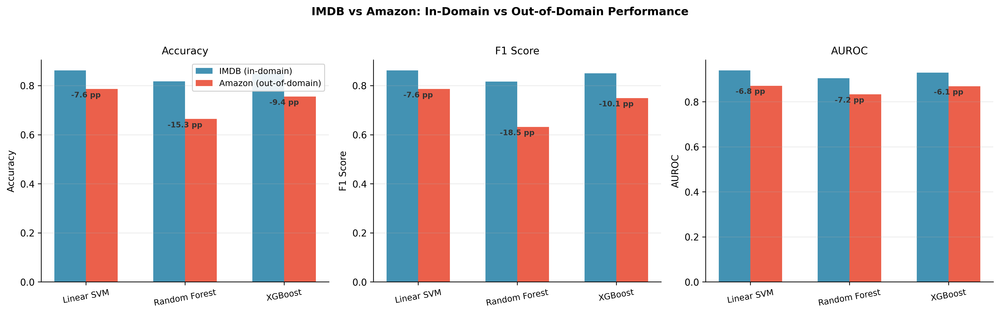
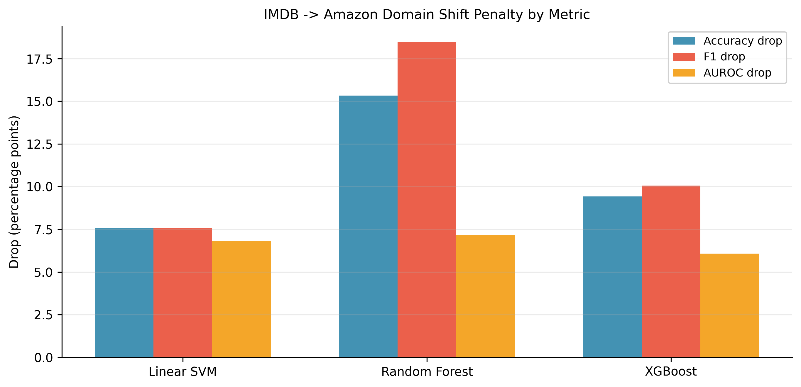
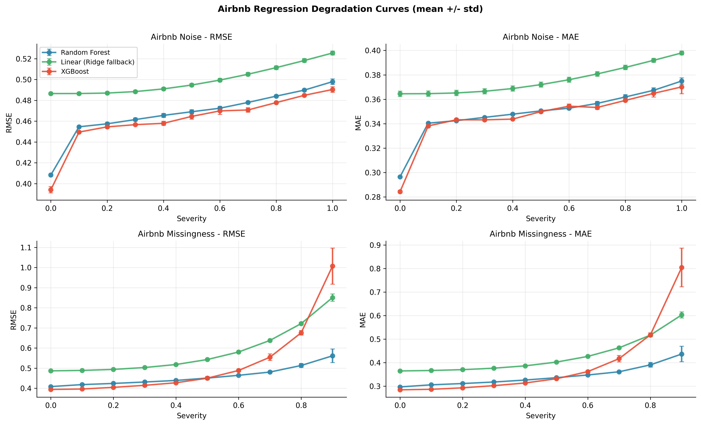
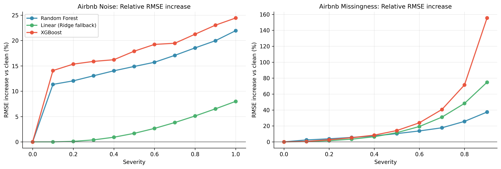
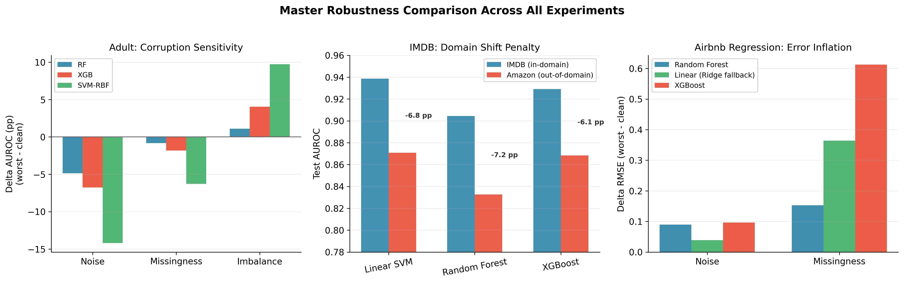

# Robustness of Machine Learning Models to Distribution Shifts and Noisy Data

## Complete Experimental Results

**Neil Daterao**
Senior Thesis -- Mathematics & Statistics
Advisor: Prof. Roger Hoerl
March 2026

---

## Overview

This document presents the complete experimental results for my senior thesis on ML model robustness. The experiments span three datasets, three model families, and multiple corruption types, totaling **452 individual experiment runs** across three seeds for stability analysis.

**Core research questions addressed:**

1. How does predictive performance degrade as a function of corruption type and severity?
2. Do ensemble models (RF, XGBoost) exhibit greater robustness than kernel-based models (SVM)?
3. Are robustness patterns under synthetic corruption similar to those under real domain shift?
4. Do robustness trends in classification extend to regression?

**Protocol:** All corruptions are applied to training data only; validation and test sets remain clean. Model hyperparameters are fixed across severity levels (no per-severity retuning). Results are reported as mean +/- std across 3 random seeds (42, 43, 44).

---

## 1. At a Glance: Robustness Heatmap

This heatmap summarizes the entire thesis in a single figure. Each cell shows how much a model's performance changed between clean data and the worst corruption severity tested. Green cells indicate robust models (small degradation); red cells indicate fragile models (large degradation). Classification cells report AUROC change in percentage points; regression cells report absolute RMSE increase.

**Key patterns visible at a glance:**
- SVM-RBF is consistently red across all Adult corruptions -- it is the least robust tabular model.
- IMDB token dropout is uniformly green -- synthetic text corruption has minimal impact on any model.
- IMDB domain shift shows moderate, roughly uniform penalties -- all models struggle with real distribution change.
- Airbnb missingness shows a stark gradient: RF stays relatively green while XGBoost turns deep red.

---

## 2. Experiment Coverage

| Experiment Block | Dataset | Corruption | Models | Severity Points | Seeds | Runs |
|---|---|---|---|---:|---:|---:|
| Tabular classification | Adult Income | Additive noise | RF, XGB, SVM-RBF | 11 | 3 | 99 |
| Tabular classification | Adult Income | Missingness | RF, XGB, SVM-RBF | 6 | 3 | 54 |
| Tabular classification | Adult Income | Class imbalance | RF, XGB, SVM-RBF | 5 | 3 | 45 |
| Text classification | IMDB | Token dropout | Linear SVM, RF, XGB | 6 | 3 | 54 |
| Text domain shift | IMDB -> Amazon | Cross-domain eval | Linear SVM, RF, XGB | -- | 3 | 9 |
| Regression | Airbnb | Additive noise | RF, Linear, XGB | 11 | 3 | 99 |
| Regression | Airbnb | Missingness | RF, Linear, XGB | 10 | 3 | 90 |
| | | | | | **Total** | **452** |

All experiment families are complete with no missing runs.

---

## 3. Adult Income -- Tabular Classification Robustness

### 3.1 Why Metric Choice Matters

Before diving into results, this figure illustrates a methodological point. All three panels show the *same experiment* (additive noise on Adult), but the story each metric tells is dramatically different:

- **Accuracy** (left): All three models cluster between 0.83 and 0.86, with barely visible separation. The 76% majority class in Adult creates an accuracy floor that masks real degradation.
- **F1** (center): Wider spread, clearer downward trends. F1 captures minority-class degradation that accuracy hides.
- **AUROC** (right): The most revealing view. SVM-RBF's collapse from 0.82 to 0.68 is immediately visible, while RF and XGBoost show controlled, gradual decline. AUROC measures ranking quality and is the most sensitive indicator of robustness.

**Takeaway:** AUROC is the primary metric used throughout this thesis because it best discriminates between robust and fragile models. Accuracy alone would miss the most important findings.

### 3.2 Additive Noise

Gaussian noise is added to numeric training features, scaled by each feature's standard deviation. Severity ranges from 0 (clean) to 1.0 (noise std = feature std).

**Test AUROC (mean +/- std across 3 seeds):**

| Severity | Random Forest | XGBoost | SVM-RBF |
|---:|---:|---:|---:|
| 0.0 | 0.874 +/- 0.004 | 0.875 +/- 0.003 | 0.824 +/- 0.006 |
| 0.5 | 0.855 +/- 0.005 | 0.841 +/- 0.004 | 0.815 +/- 0.006 |
| 1.0 | 0.825 +/- 0.004 | 0.808 +/- 0.005 | 0.682 +/- 0.033 |

**What this shows:** All three models degrade under noise, but the pattern is strikingly different. Random Forest and XGBoost lose 5-7 percentage points of AUROC across the full severity range -- a gradual, predictable decline. SVM-RBF, however, collapses by **14.2 pp**, with its AUROC falling below 0.70 and its variance ballooning (std = 0.033 at severity 1.0 vs 0.006 at clean). This indicates that the RBF kernel's decision surface is especially fragile under feature-level perturbations. The tree ensembles' axis-aligned splits provide natural resilience to additive noise.

### 3.3 Missingness

Random entries in training features are replaced with NaN and then mean-imputed. Severity ranges from 0 to 0.5 (fraction of entries masked).

**Test AUROC (mean +/- std):**

| Severity | Random Forest | XGBoost | SVM-RBF |
|---:|---:|---:|---:|
| 0.0 | 0.874 +/- 0.004 | 0.875 +/- 0.003 | 0.824 +/- 0.006 |
| 0.3 | 0.869 +/- 0.003 | 0.869 +/- 0.004 | 0.791 +/- 0.004 |
| 0.5 | 0.865 +/- 0.004 | 0.857 +/- 0.001 | 0.761 +/- 0.008 |

**What this shows:** RF and XGBoost are remarkably robust to missingness -- even at 50% missing entries, their AUROC drops by less than 2 pp. Mean imputation combined with tree-based splits handles the information loss gracefully. SVM-RBF drops by 6.3 pp, confirming that kernel-based models are more sensitive to the distortions that imputation introduces in the feature space.

### 3.4 Class Imbalance

The minority class (income > $50K) is subsampled in training data. Severity represents the target minority-to-majority ratio; Adult's natural ratio is ~0.20, so lower severity = more extreme imbalance.

**Test AUROC (mean +/- std):**

| Severity (minority ratio) | Random Forest | XGBoost | SVM-RBF |
|---:|---:|---:|---:|
| 0.02 (extreme) | 0.862 +/- 0.005 | 0.834 +/- 0.003 | 0.726 +/- 0.013 |
| 0.10 | 0.872 +/- 0.003 | 0.865 +/- 0.000 | 0.768 +/- 0.002 |
| 0.199 (near-natural) | 0.873 +/- 0.004 | 0.875 +/- 0.003 | 0.824 +/- 0.006 |

**What this shows:** At extreme imbalance (severity 0.02), all models predict mostly the majority class, but RF maintains a strong AUROC (0.862) because its ensemble structure preserves some ranking ability even with very few minority examples. SVM-RBF's AUROC plummets to 0.726, revealing that its probability calibration fails under severe imbalance. XGBoost recovers fastest as imbalance decreases, reaching near-full performance by severity 0.10.

### 3.5 Adult Summary

| Corruption | RF AUROC delta | XGB AUROC delta | SVM-RBF AUROC delta |
|---|---:|---:|---:|
| Noise (0 -> 1.0) | -4.9 pp | -6.8 pp | **-14.2 pp** |
| Missingness (0 -> 0.5) | -0.8 pp | -1.8 pp | **-6.3 pp** |
| Imbalance (0.02 -> 0.199) | +1.1 pp | +4.0 pp | **+9.7 pp** |

**Bottom line:** Random Forest is the most robust tabular model overall. SVM-RBF is the most sensitive across all three corruption types.

---

## 4. IMDB -- Text Classification Robustness

### 4.1 Token Dropout (Synthetic Corruption)

Random tokens are zeroed out in the TF-IDF training matrix. Severity ranges from 0 to 0.5 (fraction of tokens dropped).

**Test AUROC (mean +/- std):**

| Severity | Linear SVM | Random Forest | XGBoost |
|---:|---:|---:|---:|
| 0.0 | 0.941 +/- 0.003 | 0.901 +/- 0.002 | 0.923 +/- 0.003 |
| 0.3 | 0.943 +/- 0.002 | 0.899 +/- 0.002 | 0.919 +/- 0.002 |
| 0.5 | 0.941 +/- 0.004 | 0.898 +/- 0.001 | 0.912 +/- 0.001 |

**What this shows:** Synthetic token dropout has remarkably little impact on any of the three models. Linear SVM is essentially flat across the entire severity range. XGBoost shows the largest drift (~1.1 pp AUROC), but even that is mild. This suggests that TF-IDF representations on IMDB are sufficiently redundant that removing individual tokens from training does not meaningfully degrade the learned decision boundary.

### 4.2 Domain Shift (IMDB -> Amazon, Real Distribution Shift)

Models are trained on IMDB movie reviews and evaluated on both IMDB test (in-domain) and Amazon Books reviews (out-of-domain).

**In-domain vs out-of-domain performance:**

| Model | IMDB Accuracy | Amazon Accuracy | Drop (pp) | IMDB AUROC | Amazon AUROC | Drop (pp) |
|---|---:|---:|---:|---:|---:|---:|
| Linear SVM | 0.862 | 0.786 | **7.6** | 0.939 | 0.871 | **6.8** |
| XGBoost | 0.850 | 0.756 | **9.4** | 0.929 | 0.868 | **6.1** |
| Random Forest | 0.817 | 0.664 | **15.3** | 0.905 | 0.833 | **7.2** |

**What this shows:** Real domain shift causes substantially larger drops than synthetic token dropout. Linear SVM transfers best (7.6 pp accuracy drop), while Random Forest suffers a dramatic 15.3 pp accuracy collapse. This is a key thesis finding: **synthetic corruption and real distribution shift produce different robustness rankings.** Random Forest is reasonably stable under random feature perturbation but brittle when the underlying data distribution changes. Linear SVM's simpler decision boundary generalizes more effectively across domains.

### 4.3 Synthetic vs Real Shift Comparison

| Model | Token dropout AUROC penalty (0.5 vs clean) | Domain shift AUROC penalty (Amazon vs IMDB) |
|---|---:|---:|
| Linear SVM | 0.0 pp | 6.8 pp |
| Random Forest | 0.2 pp | 7.2 pp |
| XGBoost | 1.1 pp | 6.1 pp |

**Key insight:** The domain-shift penalties are 6-60x larger than the synthetic-corruption penalties. Synthetic corruption does not fully predict real-world robustness -- an important finding for practitioners who rely on noise injection as a proxy for deployment reliability.

---

## 5. Airbnb -- Regression Robustness

### 5.1 Additive Noise

**Test RMSE (mean +/- std):**

| Severity | Random Forest | Linear (Ridge) | XGBoost |
|---:|---:|---:|---:|
| 0.0 | 0.408 +/- 0.001 | 0.487 +/- 0.001 | 0.394 +/- 0.003 |
| 0.5 | 0.469 +/- 0.002 | 0.495 +/- 0.001 | 0.465 +/- 0.003 |
| 1.0 | 0.498 +/- 0.003 | 0.525 +/- 0.002 | 0.490 +/- 0.003 |

**What this shows:** All three models degrade smoothly under noise. XGBoost starts with the best clean RMSE (0.394) but converges toward RF and the linear baseline at high severity. The linear model shows the smallest absolute increase (+0.039 RMSE) because it was already weaker at baseline -- it has less to lose. In relative terms, RF and XGBoost both increase by ~22-24% while the linear model increases by only ~8%.

### 5.2 Missingness

**Test RMSE (mean +/- std):**

| Severity | Random Forest | Linear (Ridge) | XGBoost |
|---:|---:|---:|---:|
| 0.0 | 0.408 +/- 0.001 | 0.487 +/- 0.001 | 0.394 +/- 0.003 |
| 0.5 | 0.451 +/- 0.003 | 0.543 +/- 0.003 | 0.450 +/- 0.008 |
| 0.9 | 0.561 +/- 0.034 | 0.850 +/- 0.018 | 1.007 +/- 0.090 |

**What this shows:** Missingness is far more damaging than additive noise for regression. At 90% missingness, XGBoost's RMSE explodes to 1.007 (a 155% increase from clean) with very high variance (std = 0.090), indicating unstable predictions. The linear model also degrades severely (+0.364 RMSE). Random Forest is the most robust, keeping its RMSE increase to +0.153 even at 90% -- its ensemble averaging and imputation-friendly splits provide the strongest buffer.

### 5.3 Relative RMSE Increase ("How much worse did each model get, as a percentage?")

The three models start at very different baseline errors (XGBoost = 0.394, RF = 0.408, Linear = 0.487). Comparing raw RMSE increases would be misleading -- the linear model's small absolute increase (+0.039) looks great, but only because it was already inaccurate. This figure instead asks: **"By what percentage did each model's error grow compared to its own clean-data performance?"**

For example, under noise at severity 1.0:
- XGBoost: 0.394 -> 0.490, a **24% increase** from its own baseline
- RF: 0.408 -> 0.498, a **22% increase** from its own baseline
- Linear: 0.487 -> 0.525, only an **8% increase** from its own baseline

This puts all three models on the same scale regardless of where they started.

**What this shows:** Under noise, XGBoost and RF degrade at similar rates (~22-24%), while the linear model is more stable in relative terms (~8%) -- its simpler structure means noise doesn't disrupt it much, even though it's less accurate overall. Under missingness, the story reverses dramatically: XGBoost suffers a **155% relative RMSE increase** at severity 0.9, the linear model increases by 75%, and RF increases by only 37%. This confirms that RF provides the best robustness-accuracy tradeoff when data quality is severely compromised.

### 5.4 Airbnb Summary

| Corruption | RF RMSE delta | Linear RMSE delta | XGB RMSE delta |
|---|---:|---:|---:|
| Noise (0 -> 1.0) | +0.090 | +0.039 | +0.096 |
| Missingness (0 -> 0.9) | +0.153 | +0.364 | **+0.613** |

**Bottom line:** Missingness is the dominant failure mode for regression. XGBoost is strongest on clean data but most brittle under severe feature loss. RF provides the best robustness-accuracy tradeoff.

---

## 6. Cross-Experiment Synthesis

### 6.1 Answering the Research Questions

**Q1: How does performance degrade as a function of corruption type and severity?**

Degradation is monotonic and gradual for additive noise and token dropout. Missingness causes strongly non-linear degradation, especially at high severity, with error bars widening substantially. Class imbalance effects are largest when the minority class is nearly eliminated.

**Q2: Do ensemble models exhibit greater robustness than kernel/margin-based models?**

Yes, with important caveats. On Adult, RF and XGBoost consistently outperform SVM-RBF in robustness, particularly on AUROC. SVM-RBF's ranking quality degrades 2-3x more than the tree ensembles under noise and missingness. On IMDB, Linear SVM is actually the most robust text model, but this is specific to sparse TF-IDF features where the linear decision boundary generalizes well.

**Q3: Are synthetic corruption patterns similar to real domain-shift patterns?**

Partially. Model rankings under synthetic corruption (token dropout) and real domain shift (IMDB -> Amazon) agree for the top model (Linear SVM is most robust in both settings) but diverge for Random Forest, which is stable under synthetic corruption yet brittle under real domain shift. This is a practically important finding: **noise injection is an incomplete proxy for deployment robustness.**

**Q4: Do robustness trends in classification extend to regression?**

The broad pattern holds -- tree ensembles are generally more robust than linear/kernel models -- but the specific failure mode matters. In regression, missingness is far more damaging than additive noise, and XGBoost becomes the least robust model under severe missingness despite being the strongest on clean data. This nuance does not appear in the classification experiments.

### 6.2 Overall Robustness Rankings

| Dataset | Most Robust | Middle | Least Robust |
|---|---|---|---|
| Adult (tabular) | Random Forest | XGBoost | SVM-RBF |
| IMDB (text) | Linear SVM | XGBoost | Random Forest |
| Airbnb (regression) | Random Forest | Linear (Ridge) | XGBoost |

The rankings are **not universal** -- they depend on the data modality, feature representation, and corruption type. This is itself an important thesis finding.

---

## 7. Figure and Table Index

**Figures** (in `figures/`):

| # | File | Description |
|---|---|---|
| 1 | `fig01_robustness_heatmap.png` | Full-thesis robustness overview heatmap |
| 2 | `fig02_adult_metric_sensitivity.png` | Adult noise: Accuracy vs F1 vs AUROC comparison |
| 3 | `fig03_adult_auroc_curves.png` | Adult AUROC degradation curves (3 corruptions) |
| 4 | `fig04_imdb_token_dropout_metrics.png` | IMDB token dropout curves (3 metrics) |
| 5 | `fig05_imdb_domain_shift_sidebyside.png` | IMDB vs Amazon side-by-side performance |
| 6 | `fig06_imdb_domain_shift_drops.png` | Domain shift penalty breakdown by metric |
| 7 | `fig07_airbnb_absolute_curves.png` | Airbnb RMSE/MAE degradation curves (4 panels) |
| 8 | `fig08_airbnb_relative_rmse_increase.png` | Airbnb relative RMSE increase (normalized) |
| 9 | `master_combined_comparison.png` | Cross-experiment overview (3 panels) |

**Tables** (in `tables/`, CSV format for LaTeX/Word import):

| # | File | Description |
|---|---|---|
| 1 | `table01_run_coverage.csv` | Experiment completeness audit |
| 2 | `table02_adult_clean_vs_worst.csv` | Adult: clean vs worst severity, all metrics |
| 3 | `table03_imdb_token_dropout_clean_vs_worst.csv` | IMDB dropout: clean vs worst, all metrics |
| 4 | `table04_imdb_domain_shift_drops.csv` | IMDB -> Amazon: all metrics with drops |
| 5 | `table05_airbnb_clean_vs_worst.csv` | Airbnb: clean vs worst, RMSE and MAE |

**Machine-readable summary:** `master_summary_stats.json`

---

## Use of AI

This document and experiments were prepared with AI-assisted tools (Cursor/LLM). AI was used to execute the experiment pipeline, aggregate numerical results, generate plots, and structure the write-up. All experimental design choices, corruption definitions, research questions, and interpretations are the author's. Numerical results come directly from the executed pipeline runs.
