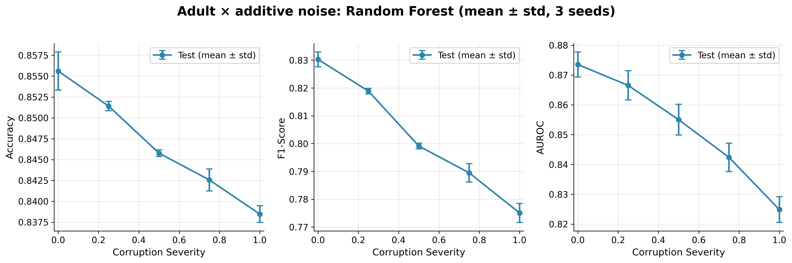
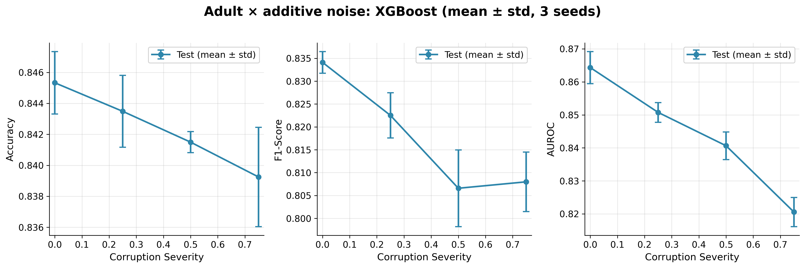
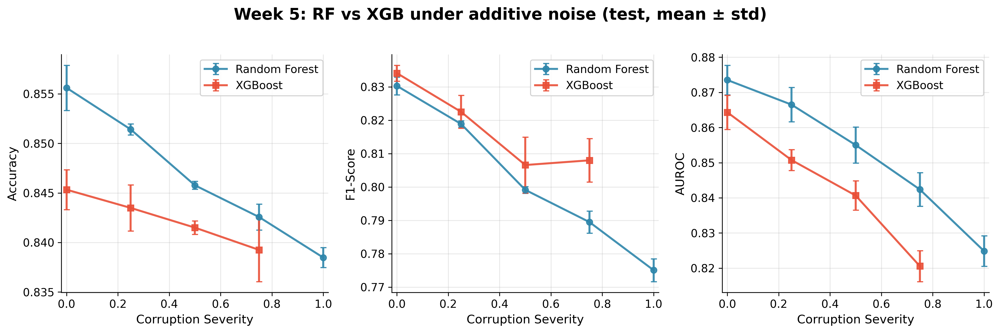

# Mid-Term Progress Memo (Week 5)

**Student:** Neil Daterao  
**Advisor:** Prof. Roger Hoerl  
**Date:** February 2026  
**Thesis:** Robustness of Machine Learning Models to Distribution Shifts and Noisy Data

---

## 1. Summary

Progress is on track with the Winter Term Revised Plan. Weeks 1–4 deliverables are complete: baselines, Methods drafting, corruption modules, and pilot experiments with a confirmed experimental design. Week 5 focused on **stability and variance analysis** and **multi-model comparison**, yielding run-to-run variance estimates and RF vs XGBoost comparison under additive noise.

> **Audit note (post-run):** A later code audit identified preprocessing leakage in the original pipeline (scaling/vectorization fitted before split in some paths). The code has now been fixed; Week 5 figures should be treated as provisional until regenerated with the corrected pipeline.

---

## 2. Completed Work (Weeks 1–4)

| Week | Deliverable | Status |
|------|-------------|--------|
| 1 | Baseline accuracy/F1/RMSE tables (Adult, IMDB, Airbnb) | Done |
| 2 | Draft Methods section; preliminary baseline plots | Done |
| 3 | Validated corruption scripts; finalized experimental configuration | Done |
| 4 | Pilot results summary; confirmed experimental design | Done |

**Highlights:**
- **Pipelines:** Baseline and corruption pipelines run end-to-end with config-driven experiments. Corruptions implemented: additive noise, missingness, class imbalance (tabular), token dropout (text).
- **Pilot results:** Severity grids run for Adult (additive noise, missingness), IMDB (token dropout). Degradation curves are monotonic where expected; validation and test track closely.
- **Design doc:** `outputs/WEEK4_RESULTS.md` documents pilot results, full experimental design (what we run: Adult × noise/missingness/imbalance, IMDB × token dropout, IMDB→Amazon, Airbnb × noise/missingness), hyperparameter tuning protocol (tune on clean only, freeze across severity), and glossary for the reader.

---

## 3. Week 5: Stability and Variance Analysis

**Objectives (from plan):** Compare ensemble models across datasets; evaluate run-to-run stability and variance under corruption.

**What was done:**

1. **Multi-seed support**  
   The severity-grid CLI now accepts `--seeds` (e.g. `--seeds 42,43,44`) and an optional `--model` override. Each (severity, seed) run is logged; when multiple seeds are used, the pipeline writes a `stability_summary.json` with **mean and standard deviation** per severity for all metrics (val/test accuracy, F1, AUROC).

2. **Multi-model comparison**  
   Adult additive-noise experiments were run for:
   - **Random Forest:** 5 severities (0, 0.25, 0.5, 0.75, 1.0) × 3 seeds → 15 runs (output: `outputs/week5/adult_noise_rf/`).
   - **XGBoost:** 4 severities (0, 0.25, 0.5, 0.75) × 3 seeds → 12 runs (output: `outputs/week5/adult_noise_xgb/`).

3. **Stability and variance plots**  
   - **Stability plot (RF):** Degradation curves with **error bars** (mean ± std across 3 seeds) for test accuracy, F1, and AUROC.  
   - **Stability plot (XGB):** Same for XGBoost.  
   - **Model comparison plot:** RF vs XGB on the same axes (test metrics, mean ± std).

**Plots and results included in this memo:**  
All Week 5 figures are embedded below; the full numerical results are in §3.1 (tables). Nothing is only referenced by path—everything is in the document.

4. **Scripts**  
   - `scripts/load_multi_seed_results.py`: Loads a severity-grid directory and returns per-severity aggregates (from `stability_summary.json` or by aggregating run dirs).  
   - `scripts/plot_stability.py`: Plots single-grid stability (error bars) or multi-grid model comparison. Usage:
     - Single grid: `python scripts/plot_stability.py --grid-dir outputs/week5/adult_noise_rf --output outputs/week5/stability_rf.png`
     - Comparison: `python scripts/plot_stability.py --grid-dir outputs/week5/adult_noise_rf --grid-dir outputs/week5/adult_noise_xgb --label "Random Forest" --label "XGBoost" --output outputs/week5/model_comparison.png`

**Findings (preliminary):**
- Run-to-run variance is small (narrow error bars), so point estimates are stable across seeds.
- RF and XGB both degrade under additive noise; comparison plot supports answering “Do ensemble models differ in robustness?” in the full experiments.

---

## 3.1 Week 5 Results (Full Tables)

**Random Forest (Adult × additive noise, 3 seeds)** — test set, mean ± std:

| Severity | Test accuracy (mean ± std) | Test F1 (mean ± std) | Test AUROC (mean ± std) |
|----------|----------------------------|----------------------|--------------------------|
| 0.00 | 0.8556 ± 0.0023 | 0.8303 ± 0.0027 | 0.8735 ± 0.0042 |
| 0.25 | 0.8514 ± 0.0005 | 0.8189 ± 0.0010 | 0.8665 ± 0.0049 |
| 0.50 | 0.8458 ± 0.0004 | 0.7991 ± 0.0010 | 0.8550 ± 0.0051 |
| 0.75 | 0.8426 ± 0.0013 | 0.7895 ± 0.0033 | 0.8424 ± 0.0048 |
| 1.00 | 0.8385 ± 0.0010 | 0.7751 ± 0.0034 | 0.8249 ± 0.0043 |

**XGBoost (Adult × additive noise, 3 seeds)** — test set, mean ± std:

| Severity | Test accuracy (mean ± std) | Test F1 (mean ± std) | Test AUROC (mean ± std) |
|----------|----------------------------|----------------------|--------------------------|
| 0.00 | 0.8453 ± 0.0020 | 0.8341 ± 0.0024 | 0.8643 ± 0.0049 |
| 0.25 | 0.8435 ± 0.0023 | 0.8225 ± 0.0049 | 0.8507 ± 0.0030 |
| 0.50 | 0.8415 ± 0.0007 | 0.8066 ± 0.0084 | 0.8407 ± 0.0042 |
| 0.75 | 0.8392 ± 0.0032 | 0.8080 ± 0.0065 | 0.8206 ± 0.0044 |

**Interpretation:** Both models show an overall downward degradation trend as noise severity increases. RF is monotonic in the reported test metrics; XGB has a tiny local non-monotonic bump in test F1 at 0.75 vs 0.50 (+0.14 pp), which is well within the reported standard deviations and therefore not practically meaningful. RF has slightly higher clean (severity 0) test accuracy and AUROC than XGB; variance across seeds is small (std &lt; 0.01 for most points). The plots above show the same data with error bars.

---

## 3.2 Explanation of These Results

**What we did.** We trained two models (Random Forest and XGBoost) on the Adult Income dataset. For each model we ran the *same* experiment multiple times with different random seeds (42, 43, 44). In each run we added **additive Gaussian noise** to the numeric features in the *training* data only; the amount of noise is controlled by **severity** (0 = no noise, 1 = noise with standard deviation equal to each feature’s standard deviation). We then evaluated on a held-out **test** set that was never corrupted. So the tables and plots show: *as we corrupt the training data more (higher severity), how does test performance change?*

**What the metrics mean.**  
- **Test accuracy:** Fraction of test examples classified correctly.  
- **Test F1:** Balance of precision and recall (especially relevant because Adult has class imbalance).  
- **Test AUROC:** Ability to rank positive vs negative; 0.5 = random, 1.0 = perfect.  

**What “degradation” means.** As severity goes from 0 → 1, we are adding more noise to the training features. Both models **get worse** on the test set: accuracy drops (e.g. RF from ~85.6% to ~83.8%), F1 drops more (e.g. RF from ~83% to ~77.5%), and AUROC drops (e.g. RF from ~0.87 to ~0.82). That is the expected **robustness** signal: noisier training data leads to worse generalization. The curves are near-monotonic with only very small local fluctuations (e.g., XGB F1 at 0.75 vs 0.50) that are within seed-level variance.

**What the error bars (mean ± std) mean.** Each point is the **mean** over 3 runs (one per seed); the **std** is the standard deviation across those 3 runs. The error bars are small (often &lt; 0.01), so the results are **stable**: changing the random seed does not change the story. That gives confidence that the full experiments (Weeks 6–8) will not be dominated by run-to-run noise.

**RF vs XGB.** On **clean data** (severity 0), Random Forest has slightly higher test accuracy and AUROC than XGBoost in this setup (e.g. RF ~85.6% vs XGB ~84.5%). As noise increases, **both** models degrade; the comparison plot shows they follow similar downward trends. So far we are not seeing one model as clearly “more robust” than the other; the full factorial (more corruptions, more models, more seeds) in later weeks will allow a proper comparison. The main takeaway here is that **both** ensemble models are sensitive to additive noise in the way the Methods section describes, and that multi-seed aggregation gives stable, interpretable curves.

---

## 4. Next Steps (Weeks 6–8)

| Week | Focus | Planned deliverables |
|------|--------|----------------------|
| 6 | Tabular domain experiments | Full robustness experiments on Adult (noise, missingness, imbalance × RF, XGB, SVM); aggregated tabular results; draft degradation curves |
| 7 | Text domain experiments | IMDB→Amazon robustness; token dropout and domain-shift; model comparison (SVM, RF, XGB) |
| 8 | Regression and full analysis | Airbnb noise/missingness; aggregate all results; final figures and tables; start Results section draft |

**Immediate next actions:**
- Run full Adult severity grids (e.g. 11 points for noise, 6 for missingness) with 3–5 seeds and all three model classes (RF, XGB, SVM) for Week 6.
- Implement or document hyperparameter tuning (tune on clean data only, then freeze) if not yet used in production runs.
- Add IMDB→Amazon evaluation path (train on IMDB, evaluate on Amazon) for Week 7.

---

## 5. Blockers and Risks

- **None critical.** Pipeline and configs are in place; Week 5 experiments completed successfully. Full factorial runs (Week 6–7) will be compute-heavy; runtime estimates from pilots support planning (e.g. ~1–2 min per run for Adult).

---

## 6. Deliverables Checklist (Week 5)

- [x] Mid-term progress memo (this document)
- [x] Stability and variance plots: **stability_rf.png**, **stability_xgb.png**, **model_comparison.png** (all embedded above)
- [x] Full results tables: RF and XGB test metrics (mean ± std) in §3.1
- [x] Multi-seed aggregation and plotting scripts
- [x] Adult noise × RF (15 runs) and × XGB (12 runs) multi-seed runs

---

## 7. Output Files (Week 5)

All plots and this memo live in `outputs/week5/`. The three figures embedded above are `stability_rf.png`, `stability_xgb.png`, and `model_comparison.png`. Raw run outputs: `adult_noise_rf/` (15 runs), `adult_noise_xgb/` (12 runs). Aggregated metrics: `adult_noise_xgb/stability_summary.json`; RF aggregates were computed from run dirs for the tables in §3.1.
