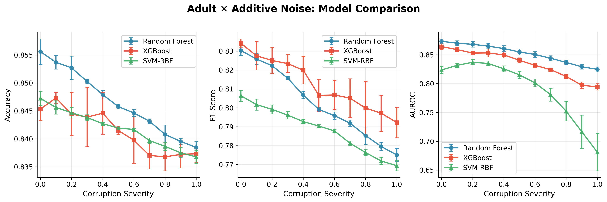
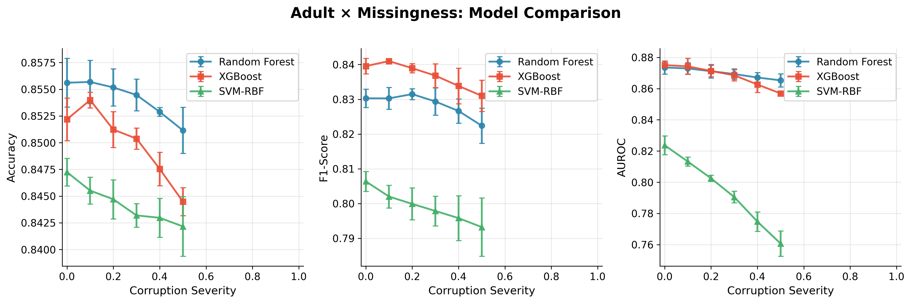
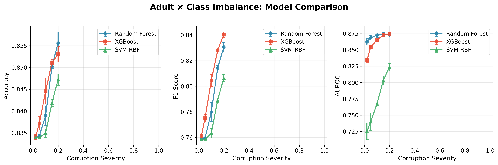

# Week 6: Tabular Domain Experiments — Full Results

**Date:** February 2026  
**Objective:** Full robustness experiments on Adult Income: additive noise, missingness, and class imbalance × Random Forest, XGBoost, SVM-RBF.  
**All runs completed.** 3 corruptions × 3 models × multi-seed (42, 43, 44).

> **Audit note (post-run):** A code audit identified preprocessing leakage in the original pipeline (feature scaling was fitted before split). The pipeline has now been fixed to fit preprocessing on train only. Re-running Week 6 with the corrected pipeline is recommended for final thesis numbers.

---

## 1. Experimental Design

| Corruption      | Severity range | Points | Models | Seeds | Total runs |
|-----------------|----------------|--------|--------|-------|------------|
| Additive noise | 0.0 → 1.0      | 11     | RF, XGB, SVM-RBF | 42,43,44 | 99 |
| Missingness    | 0.0 → 0.5      | 6      | RF, XGB, SVM-RBF | 42,43,44 | 54 |
| Class imbalance| 0.02, 0.05, 0.10, 0.15, 0.199 | 5 | RF, XGB, SVM-RBF | 42,43,44 | 45 |

**Protocol:** Corruptions applied to training data only; val/test stay clean. Model hyperparameters are fixed across severity levels (no per-severity retuning). Multi-seed mean ± std reported.

**Note on class imbalance severities:** Adult has a natural minority/majority ratio of ~0.20. Severity = target (minority size / majority size). Only severities below ~0.20 actually reduce the minority class; we tested 0.02–0.199 to capture the transition.

---

## 2. Additive Noise — Full Results

### 2.1 Random Forest

| Severity | Test Accuracy | Test F1 | Test AUROC |
|----------|---------------|---------|------------|
| 0.0 | 0.856 ± 0.002 | 0.830 ± 0.003 | 0.874 ± 0.004 |
| 0.1 | 0.854 ± 0.001 | 0.826 ± 0.003 | 0.870 ± 0.004 |
| 0.2 | 0.853 ± 0.002 | 0.822 ± 0.004 | 0.868 ± 0.005 |
| 0.3 | 0.850 ± 0.000 | 0.816 ± 0.001 | 0.865 ± 0.005 |
| 0.4 | 0.848 ± 0.001 | 0.807 ± 0.002 | 0.861 ± 0.005 |
| 0.5 | 0.846 ± 0.000 | 0.799 ± 0.001 | 0.855 ± 0.005 |
| 0.6 | 0.845 ± 0.001 | 0.796 ± 0.002 | 0.851 ± 0.005 |
| 0.7 | 0.843 ± 0.000 | 0.792 ± 0.002 | 0.844 ± 0.004 |
| 0.8 | 0.841 ± 0.002 | 0.785 ± 0.005 | 0.837 ± 0.004 |
| 0.9 | 0.840 ± 0.000 | 0.780 ± 0.002 | 0.829 ± 0.004 |
| 1.0 | 0.838 ± 0.001 | 0.775 ± 0.003 | 0.825 ± 0.004 |

**RF summary:** Accuracy drop = 1.7 pp; F1 drop = 5.5 pp; AUROC drop = 4.9 pp (severity 0→1).

### 2.2 XGBoost

| Severity | Test Accuracy | Test F1 | Test AUROC |
|----------|---------------|---------|------------|
| 0.0 | 0.845 ± 0.002 | 0.834 ± 0.002 | 0.864 ± 0.005 |
| 0.1 | 0.847 ± 0.001 | 0.828 ± 0.007 | 0.859 ± 0.004 |
| 0.2 | 0.844 ± 0.004 | 0.825 ± 0.007 | 0.853 ± 0.002 |
| 0.3 | 0.844 ± 0.005 | 0.823 ± 0.005 | 0.853 ± 0.007 |
| 0.4 | 0.845 ± 0.004 | 0.820 ± 0.007 | 0.850 ± 0.005 |
| 0.5 | 0.841 ± 0.001 | 0.807 ± 0.008 | 0.841 ± 0.004 |
| 0.6 | 0.840 ± 0.004 | 0.807 ± 0.008 | 0.832 ± 0.001 |
| 0.7 | 0.837 ± 0.002 | 0.805 ± 0.010 | 0.824 ± 0.002 |
| 0.8 | 0.837 ± 0.002 | 0.800 ± 0.014 | 0.813 ± 0.003 |
| 0.9 | 0.837 ± 0.002 | 0.797 ± 0.009 | 0.797 ± 0.006 |
| 1.0 | 0.837 ± 0.002 | 0.792 ± 0.008 | 0.794 ± 0.005 |

**XGB summary:** Accuracy drop = 0.8 pp; F1 drop = 4.2 pp; AUROC drop = 7.0 pp (severity 0→1).

### 2.3 SVM-RBF

| Severity | Test Accuracy | Test F1 | Test AUROC |
|----------|---------------|---------|------------|
| 0.0 | 0.847 ± 0.001 | 0.806 ± 0.003 | 0.824 ± 0.006 |
| 0.1 | 0.846 ± 0.001 | 0.802 ± 0.003 | 0.832 ± 0.003 |
| 0.2 | 0.845 ± 0.001 | 0.799 ± 0.002 | 0.837 ± 0.004 |
| 0.3 | 0.844 ± 0.000 | 0.796 ± 0.002 | 0.835 ± 0.004 |
| 0.4 | 0.843 ± 0.000 | 0.793 ± 0.001 | 0.826 ± 0.005 |
| 0.5 | 0.842 ± 0.000 | 0.790 ± 0.001 | 0.815 ± 0.006 |
| 0.6 | 0.842 ± 0.000 | 0.788 ± 0.001 | 0.801 ± 0.007 |
| 0.7 | 0.840 ± 0.000 | 0.781 ± 0.001 | 0.781 ± 0.011 |
| 0.8 | 0.839 ± 0.001 | 0.776 ± 0.002 | 0.752 ± 0.017 |
| 0.9 | 0.838 ± 0.001 | 0.772 ± 0.002 | 0.717 ± 0.029 |
| 1.0 | 0.837 ± 0.001 | 0.769 ± 0.003 | 0.681 ± 0.032 |

**SVM-RBF summary:** Accuracy drop = 1.0 pp; F1 drop = 3.7 pp; AUROC drop = **14.3 pp** (severity 0→1). SVM-RBF's AUROC degrades dramatically at high noise, and shows high variance (std up to 0.032), unlike RF/XGB.

**Why the SVM-RBF curve can look “parabolic”:** At low noise (0.0→0.2), AUROC rises slightly (0.824→0.837), which is consistent with a mild regularization/smoothing effect from small perturbations. Beyond that, additional noise overwhelms the margin structure and AUROC drops sharply. So the shape is a small early bump plus a strong downward tail, not a code error by itself.

### 2.4 Model Comparison (Additive Noise)



**Key findings:**
- **Accuracy** is similar across all three models (all ~84–86% → ~84%). Accuracy is relatively insensitive to noise because Adult's majority class (76%) provides a high floor.
- **F1** degrades by 4–6 pp for all models. RF shows the steepest drop; XGB is slightly more variable (wider std at high severity).
- **AUROC** is the most discriminating metric: **SVM-RBF collapses** at high noise (0.824 → 0.681), while RF (0.874 → 0.825) and XGB (0.864 → 0.794) degrade more gracefully. This indicates SVM-RBF's decision surface is particularly sensitive to feature-level noise.
- **Why SVM AUROC starts lower than RF/XGB (even at severity 0):** With the current defaults (`C=1`, `gamma='scale'`) on Adult, SVM-RBF is less well-calibrated for ranking under class imbalance than the tree ensembles. The key point is AUROC (ranking quality), not just accuracy; SVM accuracy is close to others, but its ranking degrades more under corruption.

---

## 3. Missingness — Full Results

### 3.1 Summary Table (test accuracy, mean ± std)

| Severity | RF | XGB | SVM-RBF |
|----------|-----|------|---------|
| 0.0 | 0.856 ± 0.002 | 0.852 ± 0.002 | 0.847 ± 0.001 |
| 0.1 | 0.856 ± 0.002 | 0.854 ± 0.001 | 0.846 ± 0.001 |
| 0.2 | 0.855 ± 0.002 | 0.851 ± 0.002 | 0.845 ± 0.002 |
| 0.3 | 0.854 ± 0.001 | 0.850 ± 0.001 | 0.843 ± 0.001 |
| 0.4 | 0.853 ± 0.000 | 0.848 ± 0.002 | 0.843 ± 0.002 |
| 0.5 | 0.851 ± 0.002 | 0.844 ± 0.001 | 0.842 ± 0.003 |

### 3.2 Summary Table (test AUROC, mean ± std)

| Severity | RF | XGB | SVM-RBF |
|----------|-----|------|---------|
| 0.0 | 0.874 ± 0.004 | 0.875 ± 0.003 | 0.824 ± 0.006 |
| 0.1 | 0.873 ± 0.004 | 0.874 ± 0.005 | 0.813 ± 0.003 |
| 0.2 | 0.871 ± 0.004 | 0.871 ± 0.004 | 0.802 ± 0.002 |
| 0.3 | 0.869 ± 0.003 | 0.869 ± 0.004 | 0.791 ± 0.004 |
| 0.4 | 0.867 ± 0.003 | 0.863 ± 0.005 | 0.775 ± 0.006 |
| 0.5 | 0.865 ± 0.004 | 0.857 ± 0.001 | 0.761 ± 0.008 |



**Key findings:**
- **RF and XGB are highly robust** to missingness up to 50%: accuracy drops &lt;0.5 pp, AUROC drops ~1 pp. Mean imputation + tree-based models handle missing values well.
- **SVM-RBF is more sensitive**: AUROC drops from 0.824 to 0.761 (6.3 pp) at 50% missingness, and its clean-data AUROC is already lower than RF/XGB. This confirms SVM-RBF struggles with imputed data patterns.

---

## 4. Class Imbalance — Full Results

Severity = minority-to-majority ratio in training set. Lower severity = more imbalanced.

### 4.1 Summary Table (test metrics, mean ± std)

| Severity | RF Accuracy | RF F1 | XGB Accuracy | XGB F1 | SVM Accuracy | SVM F1 |
|----------|-------------|-------|--------------|--------|--------------|--------|
| 0.02 | 0.834 ± 0.000 | 0.758 ± 0.000 | 0.834 ± 0.001 | 0.761 ± 0.001 | 0.834 ± 0.000 | 0.758 ± 0.000 |
| 0.05 | 0.834 ± 0.000 | 0.760 ± 0.000 | 0.837 ± 0.002 | 0.775 ± 0.003 | 0.834 ± 0.000 | 0.758 ± 0.000 |
| 0.10 | 0.839 ± 0.002 | 0.780 ± 0.007 | 0.845 ± 0.003 | 0.805 ± 0.005 | 0.835 ± 0.001 | 0.763 ± 0.004 |
| 0.15 | 0.850 ± 0.000 | 0.814 ± 0.002 | 0.851 ± 0.001 | 0.828 ± 0.002 | 0.842 ± 0.001 | 0.789 ± 0.002 |
| 0.199 | 0.856 ± 0.003 | 0.831 ± 0.004 | 0.853 ± 0.002 | 0.840 ± 0.002 | 0.847 ± 0.001 | 0.806 ± 0.003 |

### 4.2 Summary Table (test AUROC, mean ± std)

| Severity | RF | XGB | SVM-RBF |
|----------|-----|------|---------|
| 0.02 | 0.862 ± 0.005 | 0.834 ± 0.003 | 0.725 ± 0.013 |
| 0.05 | 0.869 ± 0.004 | 0.855 ± 0.002 | 0.740 ± 0.013 |
| 0.10 | 0.872 ± 0.003 | 0.865 ± 0.000 | 0.768 ± 0.002 |
| 0.15 | 0.874 ± 0.003 | 0.873 ± 0.003 | 0.803 ± 0.007 |
| 0.199 | 0.873 ± 0.004 | 0.875 ± 0.003 | 0.824 ± 0.006 |



**Key findings:**
- At extreme imbalance (severity 0.02), all models predict almost exclusively the majority class: accuracy ~83.4% (≈ majority class fraction), F1 ~0.758.
- **XGB recovers fastest** as imbalance decreases: by severity 0.10 it already reaches F1 0.805, while RF is at 0.780 and SVM at 0.763.
- **SVM-RBF is most sensitive to imbalance**: its AUROC at severity 0.02 is only 0.725, compared to RF's 0.862 and XGB's 0.834. This indicates SVM-RBF's probability calibration degrades severely under imbalanced training.
- At the natural ratio (severity ~0.199), performance matches clean baselines (as expected).

---

## 5. Cross-Corruption Synthesis

### 5.1 Robustness Ranking

| Model | Noise robustness | Missingness robustness | Imbalance robustness | Overall |
|-------|-----------------|----------------------|---------------------|---------|
| **Random Forest** | Good (gradual, monotonic) | Excellent (&lt;0.5 pp acc drop) | Good (recovers above 0.10) | **Most robust overall** |
| **XGBoost** | Good (similar to RF for accuracy) | Good (~1 pp AUROC drop) | Best at moderate imbalance | **Strong, slightly more variable** |
| **SVM-RBF** | Poor AUROC (14 pp drop) | Poor AUROC (6 pp drop) | Poor AUROC at low severity | **Least robust** |

### 5.2 Metric Sensitivity

| Metric | Sensitivity to corruption |
|--------|--------------------------|
| Accuracy | **Low** — Adult's 76% majority class creates a high accuracy floor |
| F1 | **Moderate** — Captures minority class degradation better |
| AUROC | **High** — Most sensitive to ranking/calibration changes; best for robustness comparison |

---

## 6. Deliverables Checklist

- [x] Full severity grids for noise (11 pts × 3 models × 3 seeds = 99 runs)
- [x] Full severity grids for missingness (6 pts × 3 models × 3 seeds = 54 runs)
- [x] Full severity grids for imbalance (5 pts × 3 models × 3 seeds = 45 runs)
- [x] Model comparison plots: `adult_noise_comparison.png`, `adult_missingness_comparison.png`, `adult_imbalance_comparison.png`
- [x] Summary tables with mean ± std across seeds
- [x] Cross-corruption synthesis and robustness ranking

---

## 7. Output Files

```
outputs/week6/
├── adult_noise_rf/                 # 33 runs + stability_summary.json
├── adult_noise_xgb/                # 33 runs + stability_summary.json
├── adult_noise_svm/                # 33 runs + stability_summary.json
├── adult_missingness_rf/           # 18 runs + stability_summary.json
├── adult_missingness_xgb/          # 18 runs + stability_summary.json
├── adult_missingness_svm/          # 18 runs + stability_summary.json
├── adult_imbalance_rf/             # 15 runs + stability_summary.json
├── adult_imbalance_xgb/            # 15 runs + stability_summary.json
├── adult_imbalance_svm/            # 15 runs + stability_summary.json
├── adult_noise_comparison.png
├── adult_missingness_comparison.png
├── adult_imbalance_comparison.png
└── WEEK6_RESULTS.md
```

---

## 8. Validity note

Corruptions (noise, missingness, class imbalance) are applied **only to the training data**; validation and test sets stay clean. So reported drops reflect “training on corrupted data, evaluating on clean data.” The small missingness drops for RF/XGB (&lt;0.5 pp accuracy) are consistent with mean imputation + tree-based models; they are real effects, not “zero degradation.”

---

## 9. Use of AI

This document and experiments were prepared with AI-assisted tools (Cursor/LLM). AI was used to run the experiment pipeline, aggregate numerical results into tables, generate plots, and structure the write-up. All experimental design choices, corruption definitions, and interpretations remain the author's. Numerical results come directly from the executed pipeline runs.
