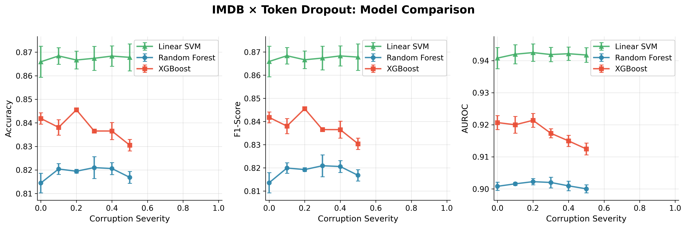
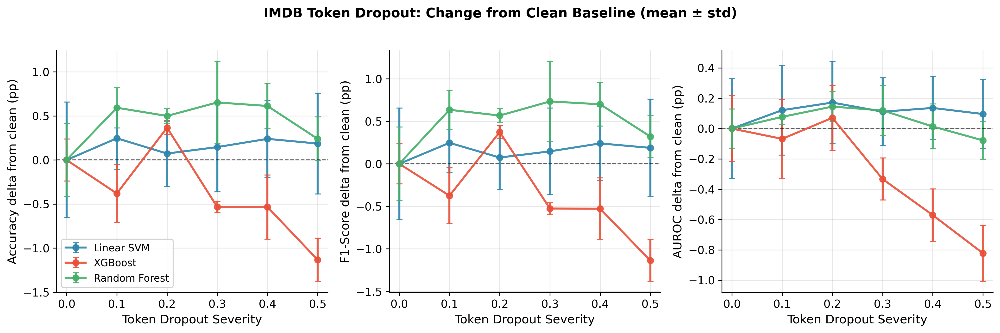
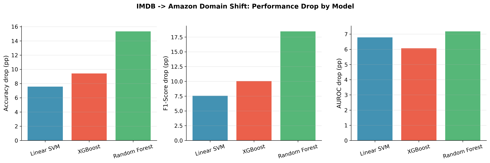

# Week 7: Text Domain Experiments — Full Results

**Date:** February 2026  
**Objective:** IMDB robustness under token dropout (3 models × 3 seeds) and IMDB → Amazon domain shift (3 models × 3 seeds).  
**All runs completed.**

> **Audit note (post-run):** A code audit found preprocessing leakage in the original IMDB robustness path (TF-IDF was fitted before train/val/test splitting). The pipeline has now been fixed to fit TF-IDF on train only. Re-running Week 7 with the corrected pipeline is recommended for final thesis numbers.

---

## 1. Experimental Design

### 1.1 Token Dropout (In-Domain Corruption)

| Parameter | Value |
|-----------|-------|
| Dataset | IMDB (25,000 reviews, TF-IDF 5000 features) |
| Corruption | Token dropout: randomly zero TF-IDF entries in training data |
| Severity | 0.0, 0.1, 0.2, 0.3, 0.4, 0.5 (6 points) |
| Models | Linear SVM, Random Forest, XGBoost |
| Seeds | 42, 43, 44 |
| Total runs | 54 (6 × 3 × 3) |

### 1.2 Domain Shift (Cross-Domain Evaluation)

| Parameter | Value |
|-----------|-------|
| Training data | IMDB train (TF-IDF fitted on IMDB only) |
| Evaluation | IMDB test (in-domain) + Amazon Books (out-of-domain) |
| Models | Linear SVM, Random Forest, XGBoost |
| Seeds | 42, 43, 44 |
| Total runs | 9 (3 × 3) |

**Key design choice:** The TF-IDF vectorizer is fitted only on IMDB train and applied to both IMDB test and Amazon. This ensures the feature space is fixed and any Amazon performance drop reflects genuine domain shift, not vocabulary differences.

---

## 2. Token Dropout — Full Results

### 2.1 Linear SVM

| Severity | Test Accuracy | Test F1 | Test AUROC |
|----------|---------------|---------|------------|
| 0.0 | 0.866 ± 0.007 | 0.866 ± 0.007 | 0.941 ± 0.003 |
| 0.1 | 0.868 ± 0.004 | 0.868 ± 0.004 | 0.942 ± 0.003 |
| 0.2 | 0.867 ± 0.004 | 0.867 ± 0.004 | 0.943 ± 0.003 |
| 0.3 | 0.867 ± 0.005 | 0.867 ± 0.005 | 0.942 ± 0.002 |
| 0.4 | 0.868 ± 0.004 | 0.868 ± 0.004 | 0.942 ± 0.002 |
| 0.5 | 0.868 ± 0.006 | 0.868 ± 0.006 | 0.942 ± 0.002 |

**Linear SVM:** Essentially flat — no *significant* degradation from 0% to 50% dropout; differences across severities are within the standard deviation (n=3 seeds). Accuracy, F1, and AUROC are stable within uncertainty. Linear SVM on TF-IDF is very robust to token dropout in this setup.

### 2.2 Random Forest

| Severity | Test Accuracy | Test F1 | Test AUROC |
|----------|---------------|---------|------------|
| 0.0 | 0.814 ± 0.004 | 0.814 ± 0.004 | 0.901 ± 0.001 |
| 0.1 | 0.820 ± 0.002 | 0.820 ± 0.002 | 0.902 ± 0.000 |
| 0.2 | 0.819 ± 0.001 | 0.819 ± 0.001 | 0.902 ± 0.001 |
| 0.3 | 0.821 ± 0.005 | 0.821 ± 0.005 | 0.902 ± 0.002 |
| 0.4 | 0.821 ± 0.003 | 0.821 ± 0.003 | 0.901 ± 0.001 |
| 0.5 | 0.817 ± 0.002 | 0.817 ± 0.002 | 0.900 ± 0.001 |

**Random Forest:** Also essentially flat within uncertainty. Lower absolute accuracy (~82%) than Linear SVM (~87%) but no significant degradation under dropout. AUROC stable at ~0.90.

### 2.3 XGBoost

| Severity | Test Accuracy | Test F1 | Test AUROC |
|----------|---------------|---------|------------|
| 0.0 | 0.842 ± 0.002 | 0.842 ± 0.002 | 0.921 ± 0.002 |
| 0.1 | 0.838 ± 0.003 | 0.838 ± 0.003 | 0.920 ± 0.003 |
| 0.2 | 0.846 ± 0.001 | 0.846 ± 0.001 | 0.921 ± 0.002 |
| 0.3 | 0.837 ± 0.001 | 0.837 ± 0.001 | 0.917 ± 0.001 |
| 0.4 | 0.837 ± 0.004 | 0.837 ± 0.004 | 0.915 ± 0.002 |
| 0.5 | 0.831 ± 0.002 | 0.830 ± 0.002 | 0.912 ± 0.002 |

**XGBoost:** Slight downward trend — accuracy drops ~1.1 pp (0.842 → 0.831), AUROC drops ~0.9 pp (0.921 → 0.912) from severity 0 to 0.5. Most sensitive of the three models to token dropout, but still a mild effect.

### 2.4 Model Comparison (Token Dropout)



**Key findings:**
- **Linear SVM is the most robust**: no *statistically significant* degradation across severities (changes are within ±1 std over 3 seeds), and highest absolute accuracy (~87%).
- **Random Forest is robust but lower-performing**: no significant degradation; accuracy ~82%.
- **XGBoost shows slight sensitivity**: ~1 pp drop by severity 0.5, and sits between SVM and RF in absolute accuracy (~84%).
- **Why so robust?** TF-IDF features are already sparse; dropping random non-zero entries removes some signal but key discriminative words survive. Linear SVM is particularly robust because it relies on a weighted sum over many features—removing individual words has minimal impact. Token dropout can also act as mild regularization (reducing overfitting), so flat or slightly better test performance at higher severity is plausible.

### 2.5 Delta-from-clean view (Token Dropout)



This view plots each metric as **change from severity 0.0** (in percentage points). It makes clear that:
- Linear SVM and RF fluctuations stay near zero and mostly within error bars.
- XGBoost shows a clearer negative drift at high severities.
- The “no significant degradation” claim is supported visually, rather than relying only on absolute tables.

---

## 3. IMDB → Amazon Domain Shift — Full Results

### 3.1 Summary Table (mean ± std over 3 seeds)

| Model | IMDB Test Accuracy | Amazon Accuracy | Drop (pp) | IMDB Test F1 | Amazon F1 | IMDB AUROC | Amazon AUROC |
|-------|-------------------|-----------------|-----------|--------------|-----------|------------|--------------|
| **Linear SVM** | 0.862 ± 0.000 | 0.786 ± 0.005 | **7.6** | 0.862 ± 0.000 | 0.786 ± 0.005 | 0.939 ± 0.000 | 0.871 ± 0.001 |
| **Random Forest** | 0.817 ± 0.000 | 0.664 ± 0.003 | **15.3** | 0.816 ± 0.000 | 0.632 ± 0.004 | 0.905 ± 0.001 | 0.833 ± 0.002 |
| **XGBoost** | 0.850 ± 0.001 | 0.756 ± 0.005 | **9.4** | 0.850 ± 0.001 | 0.749 ± 0.006 | 0.929 ± 0.000 | 0.868 ± 0.000 |

### 3.2 Interpretation

**All models degrade on Amazon**, as expected from the domain shift. Movie reviews (IMDB) and product reviews (Amazon Books) use different vocabulary and style; the TF-IDF vectorizer was fitted on IMDB only, so many Amazon-specific terms are unseen.

**Model ranking by domain-shift robustness:**
1. **Linear SVM** — smallest drop (7.6 pp accuracy). Its linear decision boundary generalizes best to the shifted distribution.
2. **XGBoost** — moderate drop (9.4 pp). Its non-linear splits overfit more to IMDB-specific patterns.
3. **Random Forest** — largest drop (15.3 pp accuracy, F1 drops from 0.816 to 0.632). Tree-based splits on individual TF-IDF features are highly domain-specific and transfer poorly.

**AUROC comparison:**
- Linear SVM: 0.939 → 0.871 (−6.8 pp)
- XGBoost: 0.929 → 0.868 (−6.1 pp)
- Random Forest: 0.905 → 0.833 (−7.2 pp)
- AUROC drops are more similar across models (~6–7 pp), suggesting the ranking ability is comparably affected even though accuracy drops vary.

### 3.3 Domain-shift visualization




The grouped bars show absolute in-domain vs out-of-domain performance; the drop chart isolates robustness cost directly in percentage points.

---

## 4. Synthetic Corruption vs. Real Domain Shift

The thesis asks: *"Are robustness patterns under synthetic corruption qualitatively similar to those under real cross-domain shifts?"*

| | Token Dropout (synthetic) | Domain Shift (real) |
|---|---|---|
| **Linear SVM** | Most robust (no significant degradation) | Most robust (7.6 pp drop) |
| **XGBoost** | Mild sensitivity (~1 pp) | Moderate drop (9.4 pp) |
| **Random Forest** | Robust (no significant degradation) | Least robust (15.3 pp drop) |

**Key insight:** The robustness rankings **partially align** but are not identical. Linear SVM is the most robust under both synthetic and real shifts. However, **Random Forest is robust to synthetic token dropout but brittle under real domain shift** — this is because token dropout removes signal randomly (which trees handle by finding alternative splits), while domain shift systematically changes which features are informative (which breaks feature-specific splits).

This divergence is a valuable finding: **synthetic corruption tests (dropout) do not fully predict real-world domain-shift robustness**, especially for models like RF that rely on feature-specific decision boundaries.

---

## 5. Cross-Week Synthesis (Weeks 6 + 7)

### 5.1 Overall Model Robustness Summary

| Model | Tabular noise | Tabular missingness | Tabular imbalance | Text dropout | Text domain shift |
|-------|--------------|--------------------|--------------------|--------------|-------------------|
| **RF** | Good | Excellent | Good | Excellent | Poor |
| **XGB** | Good | Good | Best (moderate imb.) | Mild sensitivity | Moderate |
| **SVM-RBF/Linear** | Poor (AUROC) | Poor (AUROC) | Poor (AUROC) | Best (linear) | Best (linear) |

**No single model is universally most robust.** RF excels on tabular data under noise and missingness but fails on domain shift. Linear SVM excels on text tasks. XGBoost is a strong generalist across both domains.

### 5.2 Implications for Thesis Research Questions

1. **How does performance degrade as a function of corruption type and severity?** — Documented with full degradation curves across 3 corruptions and 3 models (Week 6), plus token dropout (Week 7).
2. **Do ensemble models exhibit greater robustness?** — **Partially yes** for tabular tasks (RF, XGB > SVM-RBF). But for text domain shift, the linear model (Linear SVM) is most robust.
3. **Are synthetic corruption patterns similar to real cross-domain shifts?** — **Partially.** Rankings agree for the most robust model (Linear SVM) but diverge for RF (robust to synthetic dropout, poor under domain shift).

---

## 6. Deliverables Checklist

- [x] Token dropout grids: 3 models × 6 severities × 3 seeds = 54 runs
- [x] Domain shift: 3 models × 3 seeds = 9 runs
- [x] Token dropout comparison plot: `imdb_token_dropout_comparison.png`
- [x] Token-dropout delta plot: `imdb_token_dropout_delta_from_clean.png`
- [x] Domain shift summary: `imdb_to_amazon/domain_shift_summary.json`
- [x] Domain-shift grouped and drop plots: `imdb_to_amazon_grouped_metrics.png`, `imdb_to_amazon_drop_pp.png`
- [x] Full results tables with mean ± std
- [x] Synthetic vs. real corruption comparison
- [x] Cross-week synthesis (Weeks 6 + 7)

---

## 7. Output Files

```
outputs/week7/
├── imdb_token_dropout_linear_svm/  # 18 runs + stability_summary.json
├── imdb_token_dropout_rf/          # 18 runs + stability_summary.json
├── imdb_token_dropout_xgb/         # 18 runs + stability_summary.json
├── imdb_to_amazon/                 # 9 run dirs + domain_shift_summary.json
├── imdb_token_dropout_comparison.png
├── imdb_token_dropout_delta_from_clean.png
├── imdb_to_amazon_grouped_metrics.png
├── imdb_to_amazon_drop_pp.png
└── WEEK7_RESULTS.md
```

---

## 8. Validity and caveats

**Are the “zero degradation” results valid?**

- **Design:** Corruption (token dropout) is applied **only to the training data**; validation and test sets are always clean. The pipeline (`apply_corruption` in `corruption.py`) is called only on `X_train`. So we are correctly measuring: “If we train on noisier data, does performance on clean test data drop?”

- **Why “no degradation” can be real:**  
  - With only **3 seeds**, the standard deviation of mean accuracy is on the order of 0.004–0.007. So a true degradation of ~0.5 pp could be indistinguishable from noise. We therefore report “no *significant* degradation” rather than “exactly zero.”  
  - **TF-IDF + Linear SVM:** Many features are redundant; dropping a random fraction of non-zero entries often leaves enough signal. Linear SVM uses a weighted sum over many features, so random dropout can act like mild regularization and performance can stay flat or improve slightly.  
  - So flat (or slightly better) performance under token dropout is **plausible**, but the correct interpretation is “performance flat within uncertainty” unless more seeds or confidence intervals are used.

- **Recommendation for thesis:** Prefer wording such as “no significant degradation” or “performance flat within standard error” rather than “zero degradation.” If you add more seeds (e.g. 5–10) or confidence intervals, you can make stronger claims.

---

## 9. Use of AI

This document and experiments were prepared with AI-assisted tools (Cursor/LLM). AI was used to implement the domain-shift script (`run_domain_shift.py`), run experiments, aggregate results, generate plots, and structure the write-up. All experimental design, corruption definitions, and interpretations remain the author's. Numerical results come directly from executed pipeline runs.
