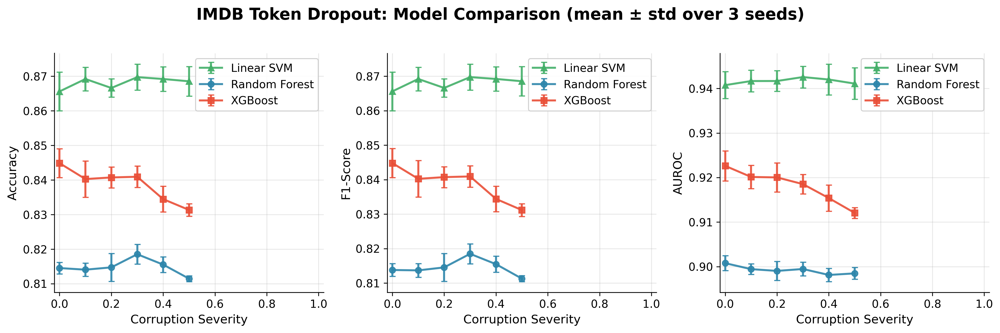
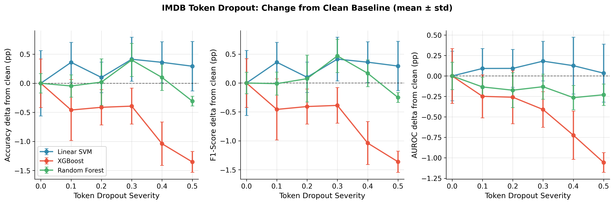
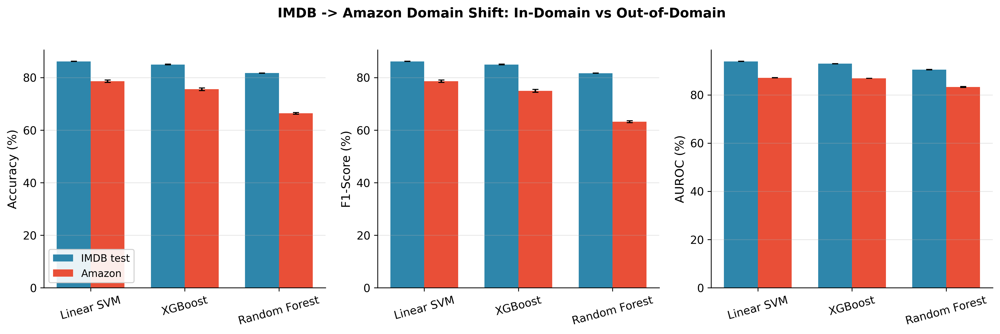
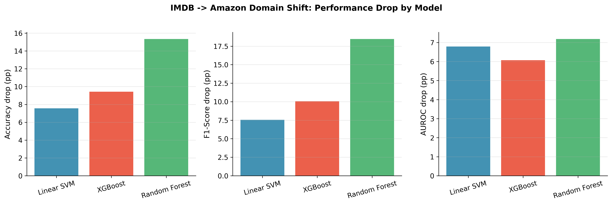

# Week 7 Rerun: Text Domain Experiments — Corrected Results

**Date:** March 2026  
**Objective:** Re-run Week 7 text robustness experiments after fixing TF-IDF preprocessing leakage, and produce corrected results for IMDB token dropout and IMDB -> Amazon domain shift.  
**Status:** All rerun experiments completed successfully.

> **Supersedes:** `outputs/week7/WEEK7_RESULTS.md` for final Week 7 numbers. The original Week 7 path used a leaky TF-IDF workflow in some runs; this rerun fits TF-IDF on IMDB train only and re-generates the analysis from corrected outputs.

---

## 1. Experimental Design

### 1.1 Token Dropout

| Parameter | Value |
|-----------|-------|
| Dataset | IMDB |
| Features | TF-IDF, 5000 features |
| Corruption | Token dropout applied to training data only |
| Severity grid | 0.0, 0.1, 0.2, 0.3, 0.4, 0.5 |
| Models | Linear SVM, Random Forest, XGBoost |
| Seeds | 42, 43, 44 |
| Total runs | 54 |

### 1.2 Domain Shift

| Parameter | Value |
|-----------|-------|
| Train data | IMDB train |
| In-domain eval | IMDB test |
| Out-of-domain eval | Amazon Books |
| Models | Linear SVM, Random Forest, XGBoost |
| Seeds | 42, 43, 44 |
| Total runs | 9 |

**Corrected pipeline detail:** The TF-IDF vectorizer is now fit on IMDB train only, then applied to IMDB test and Amazon. This removes the leakage concern noted in the original Week 7 write-up.

---

## 2. Token Dropout — Corrected Results

### 2.1 Linear SVM

| Severity | Test Accuracy | Test F1 | Test AUROC |
|----------|---------------|---------|------------|
| 0.0 | 0.866 ± 0.006 | 0.866 ± 0.006 | 0.941 ± 0.003 |
| 0.1 | 0.869 ± 0.003 | 0.869 ± 0.003 | 0.942 ± 0.002 |
| 0.2 | 0.867 ± 0.003 | 0.867 ± 0.003 | 0.942 ± 0.002 |
| 0.3 | 0.870 ± 0.004 | 0.870 ± 0.004 | 0.943 ± 0.002 |
| 0.4 | 0.869 ± 0.004 | 0.869 ± 0.004 | 0.942 ± 0.003 |
| 0.5 | 0.869 ± 0.004 | 0.869 ± 0.004 | 0.941 ± 0.004 |

**Linear SVM summary:** Performance is essentially flat within uncertainty. From severity 0.0 to 0.5, accuracy changes by only +0.3 pp, F1 by +0.3 pp, and AUROC by +0.0 pp. The corrected rerun supports the same qualitative conclusion as before: Linear SVM is highly robust to token dropout on sparse TF-IDF features.

### 2.2 Random Forest

| Severity | Test Accuracy | Test F1 | Test AUROC |
|----------|---------------|---------|------------|
| 0.0 | 0.815 ± 0.002 | 0.814 ± 0.002 | 0.901 ± 0.002 |
| 0.1 | 0.814 ± 0.002 | 0.814 ± 0.002 | 0.899 ± 0.001 |
| 0.2 | 0.815 ± 0.004 | 0.815 ± 0.004 | 0.899 ± 0.002 |
| 0.3 | 0.819 ± 0.003 | 0.818 ± 0.003 | 0.899 ± 0.002 |
| 0.4 | 0.816 ± 0.002 | 0.815 ± 0.002 | 0.898 ± 0.001 |
| 0.5 | 0.811 ± 0.001 | 0.811 ± 0.001 | 0.898 ± 0.001 |

**Random Forest summary:** Random Forest remains broadly stable, though it shows a mild decline by the highest severity. From 0.0 to 0.5, accuracy drops by about 0.3 pp, F1 by about 0.3 pp, and AUROC by about 0.2 pp. Relative to Linear SVM it is less accurate overall, but still fairly robust to synthetic token dropout.

### 2.3 XGBoost

| Severity | Test Accuracy | Test F1 | Test AUROC |
|----------|---------------|---------|------------|
| 0.0 | 0.845 ± 0.004 | 0.845 ± 0.004 | 0.923 ± 0.003 |
| 0.1 | 0.840 ± 0.005 | 0.840 ± 0.005 | 0.920 ± 0.003 |
| 0.2 | 0.841 ± 0.003 | 0.841 ± 0.003 | 0.920 ± 0.003 |
| 0.3 | 0.841 ± 0.003 | 0.841 ± 0.003 | 0.919 ± 0.002 |
| 0.4 | 0.834 ± 0.004 | 0.834 ± 0.004 | 0.915 ± 0.003 |
| 0.5 | 0.831 ± 0.002 | 0.831 ± 0.002 | 0.912 ± 0.001 |

**XGBoost summary:** XGBoost again shows the clearest negative drift under dropout. From severity 0.0 to 0.5, accuracy drops by about 1.4 pp, F1 by about 1.4 pp, and AUROC by about 1.1 pp. This is still a mild effect in absolute terms, but it is the most visible synthetic-corruption sensitivity among the three text models tested here.

### 2.4 Model Comparison



**Key findings:**
- **Linear SVM is still the most robust** under token dropout and also has the highest absolute performance.
- **Random Forest is stable but lower-performing** than the other two models across the whole severity grid.
- **XGBoost is the most sensitive** to increasing dropout severity, though the degradation is still gradual rather than catastrophic.
- The corrected rerun does **not** overturn the original narrative; it mainly confirms that the earlier qualitative conclusions were not artifacts of the leakage issue.

### 2.5 Delta-from-clean View



This delta plot makes the robustness story easier to read:
- Linear SVM fluctuates tightly around zero.
- Random Forest stays near zero with a slight negative drift at the highest severity.
- XGBoost shows the clearest downward trend, especially in accuracy/F1 at severities 0.4 and 0.5.

---

## 3. IMDB -> Amazon Domain Shift — Corrected Results

### 3.1 Summary Table

| Model | IMDB Test Accuracy | Amazon Accuracy | Drop (pp) | IMDB Test F1 | Amazon F1 | IMDB AUROC | Amazon AUROC |
|-------|-------------------|-----------------|-----------|--------------|-----------|------------|--------------|
| **Linear SVM** | 0.862 ± 0.000 | 0.786 ± 0.005 | **7.6** | 0.862 ± 0.000 | 0.786 ± 0.005 | 0.939 ± 0.000 | 0.871 ± 0.001 |
| **Random Forest** | 0.817 ± 0.000 | 0.664 ± 0.003 | **15.3** | 0.816 ± 0.000 | 0.632 ± 0.004 | 0.905 ± 0.001 | 0.833 ± 0.002 |
| **XGBoost** | 0.850 ± 0.001 | 0.756 ± 0.005 | **9.4** | 0.850 ± 0.001 | 0.749 ± 0.006 | 0.929 ± 0.000 | 0.868 ± 0.000 |

### 3.2 Interpretation

All models degrade on Amazon, as expected. The IMDB-trained vocabulary and weighting scheme transfer imperfectly to Amazon Books reviews, where wording, product-specific terminology, and review style differ from movie reviews.

**Model ranking under domain shift:**
1. **Linear SVM**: most robust, with only a 7.6 pp accuracy drop.
2. **XGBoost**: moderate degradation, with a 9.4 pp accuracy drop.
3. **Random Forest**: least robust, with a 15.3 pp accuracy drop and a large F1 collapse.

**AUROC drops:**
- Linear SVM: 0.939 -> 0.871 (-6.8 pp)
- XGBoost: 0.929 -> 0.868 (-6.1 pp)
- Random Forest: 0.905 -> 0.833 (-7.2 pp)

The AUROC drops are fairly similar across models, but the accuracy/F1 gaps are not. This suggests that ranking quality degrades comparably, while class decisions and calibration suffer more sharply for Random Forest under domain shift.

### 3.3 Domain-Shift Visualizations





These plots reinforce the main robustness story:
- Linear SVM transfers best out of domain.
- XGBoost is a reasonable middle ground.
- Random Forest is much more brittle under real distribution shift than under synthetic token dropout.

---

## 4. Synthetic Corruption vs. Real Domain Shift

The core Week 7 thesis question is whether synthetic corruption patterns resemble real cross-domain robustness patterns.

| Model | Token Dropout (synthetic) | Domain Shift (real) |
|-------|---------------------------|---------------------|
| Linear SVM | Most robust; performance flat within uncertainty | Most robust; 7.6 pp accuracy drop |
| XGBoost | Mild synthetic sensitivity | Moderate domain-shift degradation |
| Random Forest | Mild synthetic sensitivity | Worst domain-shift robustness |

**Main insight:** The rankings only partially align. Linear SVM is the most robust in both settings, but Random Forest behaves very differently across the two tests. It is reasonably stable under random feature removal, yet brittle when the domain itself changes. That makes Week 7 an important result for the thesis: **synthetic corruption does not fully predict real-world distribution-shift robustness**.

---

## 5. Takeaways for the Thesis

- The corrected rerun preserves the original Week 7 conclusions.
- Linear SVM is the strongest text model here, both in-domain and out-of-domain.
- XGBoost is a decent compromise model, but it is modestly sensitive to both token dropout and domain shift.
- Random Forest is not badly affected by synthetic token dropout, but it transfers poorly to Amazon, which highlights the difference between random corruption and semantic/domain mismatch.

---

## 6. Deliverables Included

- [x] Fresh token-dropout grids for 3 models x 6 severities x 3 seeds
- [x] Fresh IMDB -> Amazon domain-shift runs for 3 models x 3 seeds
- [x] Token-dropout comparison plot: `imdb_token_dropout_comparison.png`
- [x] Token-dropout delta plot: `imdb_token_dropout_delta_from_clean.png`
- [x] Domain-shift grouped plot: `imdb_to_amazon_grouped_metrics.png`
- [x] Domain-shift drop plot: `imdb_to_amazon_drop_pp.png`
- [x] Updated domain-shift summary JSON
- [x] Corrected Week 7 analysis document

---

## 7. Output Files

```text
outputs/week7_rerun_20260305/
├── imdb_token_dropout_linear_svm/
├── imdb_token_dropout_rf/
├── imdb_token_dropout_xgb/
├── imdb_to_amazon/
├── imdb_token_dropout_comparison.png
├── imdb_token_dropout_delta_from_clean.png
├── imdb_to_amazon_grouped_metrics.png
├── imdb_to_amazon_drop_pp.png
└── WEEK7_RERUN_RESULTS.md
```

---

## 8. Caveat

This corrected Week 7 rerun covers the executed text comparison set used in the current pipeline: `linear_svm`, `random_forest`, and `xgboost`. If strict alignment with the original broader plan requires a text `svm_rbf` comparison, that would still need to be run separately.

---

## 9. Use of AI

This document and the supporting analyses were prepared with AI-assisted tools (Cursor/LLM). AI was used to run the rerun pipeline, regenerate plots, aggregate numerical results, and structure the write-up. Experimental interpretation and the final selection of claims remain the author's responsibility. Numerical values reported here come directly from the corrected rerun outputs.
