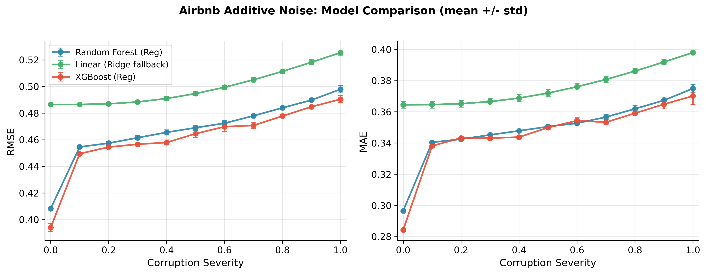
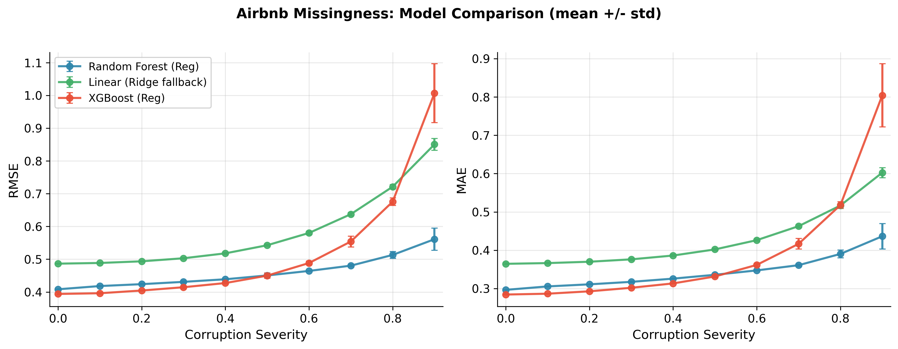

# Week 8 Results (Airbnb Regression Robustness)

Date: 2026-03-09
Datasets: Airbnb Price Prediction (`airbnb`)
Models: `random_forest_reg`, `linear_regression` (stable Ridge fallback), `xgboost_reg`
Corruptions: `additive_noise`, `missingness`
Seeds: `42, 43, 44`

## What was fixed before this rerun

- `LinearRegression` runs were stalling in this environment at fit time.
- `linear_regression` model factory was changed to a stable near-OLS fallback (`Ridge(alpha=1e-6, solver='lsqr')`) under the same model key so the Week 8 matrix can complete.
- Severity-grid stability aggregation was fixed to include regression metrics (`rmse`, `mae`) so multi-seed summaries produce complete Week 8 tables.
- Missingness `1.0` was treated as a degenerate case (all features effectively missing) and excluded from missingness families.

## Completed experiment matrix

- Additive noise (`severity=0.0..1.0`, 11 points):
  - `airbnb_noise_rf`: 33/33 runs
  - `airbnb_noise_linear`: 33/33 runs
  - `airbnb_noise_xgb`: 33/33 runs
- Missingness (`severity=0.0..0.9`, 10 points):
  - `airbnb_missingness_rf`: 30/30 runs
  - `airbnb_missingness_linear`: 30/30 runs
  - `airbnb_missingness_xgb`: 30/30 runs

## Plots

## Additive Noise (test RMSE, mean +/- std)

| Severity | RF | Linear | XGB |
|---:|---:|---:|---:|
| 0.0 | 0.4083 +/- 0.0010 | 0.4865 +/- 0.0010 | 0.3940 +/- 0.0030 |
| 0.1 | 0.4546 +/- 0.0009 | 0.4865 +/- 0.0011 | 0.4495 +/- 0.0009 |
| 0.2 | 0.4574 +/- 0.0014 | 0.4870 +/- 0.0011 | 0.4545 +/- 0.0014 |
| 0.3 | 0.4615 +/- 0.0016 | 0.4884 +/- 0.0013 | 0.4566 +/- 0.0005 |
| 0.4 | 0.4655 +/- 0.0019 | 0.4910 +/- 0.0014 | 0.4579 +/- 0.0019 |
| 0.5 | 0.4690 +/- 0.0019 | 0.4947 +/- 0.0015 | 0.4646 +/- 0.0027 |
| 0.6 | 0.4724 +/- 0.0019 | 0.4994 +/- 0.0016 | 0.4698 +/- 0.0035 |
| 0.7 | 0.4780 +/- 0.0011 | 0.5050 +/- 0.0017 | 0.4707 +/- 0.0022 |
| 0.8 | 0.4840 +/- 0.0010 | 0.5114 +/- 0.0018 | 0.4778 +/- 0.0012 |
| 0.9 | 0.4898 +/- 0.0010 | 0.5182 +/- 0.0019 | 0.4848 +/- 0.0011 |
| 1.0 | 0.4979 +/- 0.0027 | 0.5254 +/- 0.0019 | 0.4904 +/- 0.0027 |

## Additive Noise (test MAE, mean +/- std)

| Severity | RF | Linear | XGB |
|---:|---:|---:|---:|
| 0.0 | 0.2965 +/- 0.0001 | 0.3645 +/- 0.0022 | 0.2843 +/- 0.0010 |
| 0.1 | 0.3404 +/- 0.0006 | 0.3646 +/- 0.0022 | 0.3382 +/- 0.0011 |
| 0.2 | 0.3425 +/- 0.0006 | 0.3652 +/- 0.0022 | 0.3432 +/- 0.0011 |
| 0.3 | 0.3452 +/- 0.0007 | 0.3665 +/- 0.0022 | 0.3431 +/- 0.0010 |
| 0.4 | 0.3478 +/- 0.0004 | 0.3688 +/- 0.0022 | 0.3438 +/- 0.0008 |
| 0.5 | 0.3505 +/- 0.0007 | 0.3720 +/- 0.0021 | 0.3499 +/- 0.0011 |
| 0.6 | 0.3527 +/- 0.0010 | 0.3760 +/- 0.0020 | 0.3543 +/- 0.0018 |
| 0.7 | 0.3566 +/- 0.0016 | 0.3807 +/- 0.0019 | 0.3533 +/- 0.0016 |
| 0.8 | 0.3619 +/- 0.0020 | 0.3861 +/- 0.0018 | 0.3591 +/- 0.0011 |
| 0.9 | 0.3673 +/- 0.0021 | 0.3919 +/- 0.0017 | 0.3648 +/- 0.0030 |
| 1.0 | 0.3749 +/- 0.0026 | 0.3979 +/- 0.0016 | 0.3701 +/- 0.0056 |

## Missingness (test RMSE, mean +/- std)

| Severity | RF | Linear | XGB |
|---:|---:|---:|---:|
| 0.0 | 0.4083 +/- 0.0010 | 0.4865 +/- 0.0010 | 0.3940 +/- 0.0030 |
| 0.1 | 0.4182 +/- 0.0022 | 0.4886 +/- 0.0013 | 0.3962 +/- 0.0025 |
| 0.2 | 0.4239 +/- 0.0024 | 0.4936 +/- 0.0015 | 0.4045 +/- 0.0016 |
| 0.3 | 0.4309 +/- 0.0035 | 0.5030 +/- 0.0023 | 0.4145 +/- 0.0047 |
| 0.4 | 0.4388 +/- 0.0016 | 0.5180 +/- 0.0033 | 0.4273 +/- 0.0030 |
| 0.5 | 0.4505 +/- 0.0025 | 0.5426 +/- 0.0032 | 0.4499 +/- 0.0078 |
| 0.6 | 0.4643 +/- 0.0011 | 0.5801 +/- 0.0049 | 0.4884 +/- 0.0057 |
| 0.7 | 0.4804 +/- 0.0039 | 0.6375 +/- 0.0052 | 0.5541 +/- 0.0166 |
| 0.8 | 0.5131 +/- 0.0103 | 0.7213 +/- 0.0069 | 0.6755 +/- 0.0115 |
| 0.9 | 0.5611 +/- 0.0335 | 0.8504 +/- 0.0183 | 1.0067 +/- 0.0897 |

## Missingness (test MAE, mean +/- std)

| Severity | RF | Linear | XGB |
|---:|---:|---:|---:|
| 0.0 | 0.2965 +/- 0.0001 | 0.3645 +/- 0.0022 | 0.2843 +/- 0.0010 |
| 0.1 | 0.3055 +/- 0.0011 | 0.3664 +/- 0.0022 | 0.2865 +/- 0.0011 |
| 0.2 | 0.3109 +/- 0.0010 | 0.3699 +/- 0.0022 | 0.2927 +/- 0.0010 |
| 0.3 | 0.3174 +/- 0.0023 | 0.3762 +/- 0.0026 | 0.3019 +/- 0.0022 |
| 0.4 | 0.3258 +/- 0.0007 | 0.3861 +/- 0.0029 | 0.3133 +/- 0.0006 |
| 0.5 | 0.3358 +/- 0.0013 | 0.4021 +/- 0.0028 | 0.3314 +/- 0.0033 |
| 0.6 | 0.3473 +/- 0.0016 | 0.4262 +/- 0.0031 | 0.3616 +/- 0.0042 |
| 0.7 | 0.3609 +/- 0.0030 | 0.4627 +/- 0.0036 | 0.4166 +/- 0.0138 |
| 0.8 | 0.3903 +/- 0.0100 | 0.5167 +/- 0.0042 | 0.5178 +/- 0.0088 |
| 0.9 | 0.4364 +/- 0.0330 | 0.6025 +/- 0.0132 | 0.8042 +/- 0.0824 |

## Key findings

- At clean conditions (`severity=0.0`), XGBoost is best (test RMSE `0.3940`), followed by RF (`0.4083`), then linear (`0.4865`).
- Under additive noise up to `1.0`, all models degrade gradually; absolute RMSE increases are:
  - RF: `+0.0896` (`0.4083 -> 0.4979`)
  - Linear: `+0.0389` (`0.4865 -> 0.5254`)
  - XGB: `+0.0963` (`0.3940 -> 0.4904`)
- Under missingness up to `0.9`, degradation is much stronger:
  - RF: `+0.1528` RMSE (`0.4083 -> 0.5611`)
  - Linear: `+0.3639` RMSE (`0.4865 -> 0.8504`)
  - XGB: `+0.6126` RMSE (`0.3940 -> 1.0067`)
- Missingness variance (std across seeds) increases at high severity, especially for XGBoost and linear, indicating instability under severe feature loss.
- Practical takeaway: RF is the most stable under severe missingness; XGB is strongest on clean/low corruption but most brittle at high missingness.

## Artifacts

- Multi-seed summaries:
  - `airbnb_noise_rf/stability_summary.json`
  - `airbnb_noise_linear/stability_summary.json`
  - `airbnb_noise_xgb/stability_summary.json`
  - `airbnb_missingness_rf/stability_summary.json`
  - `airbnb_missingness_linear/stability_summary.json`
  - `airbnb_missingness_xgb/stability_summary.json`
- Figures:
  - `airbnb_noise_model_comparison.png`
  - `airbnb_missingness_model_comparison.png`

